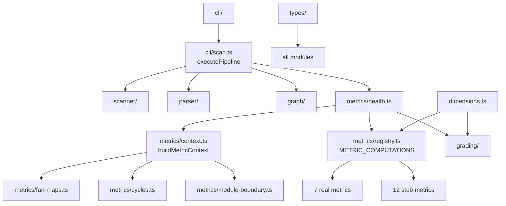

# Architecture Analysis: Group B以降の実装に向けた構造適合性評価

_Generated: 2026-03-14. Point-in-time snapshot._

## Scope & Approach

Group B（パーサー拡張）、C/D（12新メトリクス）、E（統合）、F（MCPサーバー）、G（E2E）の実装に向けて、現在のコードベース全体を分析。概要スキャン + 3つの摩擦ポイント深掘り。

## Architecture Overview



| Component | Responsibility | Key Dependencies |
|-----------|---------------|-----------------|
| `parser/` | AST解析、関数/クラス/import抽出、CC計算 | tree-sitter, types/ |
| `metrics/` | 19次元のメトリクス計算 | types/, constants, dimensions |
| `metrics/context.ts` | MetricContext構築（一度計算、全メトリクスに共有） | fan-maps, cycles, module-boundary |
| `metrics/registry.ts` | MetricComputation配列管理 | 各メトリクス実装ファイル |
| `dimensions.ts` | 閾値・ラベル・フォーマットの一元管理 | types/ |
| `grading/` | rawValue→Grade変換、compositeGrade計算 | dimensions |
| `cli/` | scan/check/gateコマンド | metrics/, grading/, rules/ |
| `graph/` | import解決、隣接リスト構築 | scanner/, oxc-resolver |

## Structural Observations

### 摩擦ポイント1: `enrichWithComplexity`の拡張性 — **要リファクタリング**

**現状** (`src/parser/index.ts:59-68`): `enrichWithComplexity`は関数ごとにASTノードを`findFunctionNode`で再発見し、CCのみ計算。

```typescript
function enrichWithComplexity(functions, root) {
  return functions.map((fn) => {
    const node = findFunctionNode(root, fn);
    if (!node) return fn;
    const cc = computeComplexity(node);
    return { ...fn, cc };
  });
}
```

**問題**: Group Bで同じ関数に対してCC + cognitiveComplexity + bodyHashの3つを計算する必要がある。現在の構造では`findFunctionNode`を1回呼んでCCだけ計算しているが、ここにcognitiveComplexityとbodyHashも追加するのが自然。

**推奨**: `enrichWithComplexity`を`enrichFunctions`にリネームし、1回のノード発見で3つ全て計算する形に拡張。Group B (T05-T07) の実装前にリネーム＆シグネチャ整理しておくとクリーン。

**影響度**: 低（リネーム + 引数追加のみ）

### 摩擦ポイント2: MetricContextの肥大化リスク — **対応不要**

Scout分析では「MetricContextが5-10フィールド増える」と警告したが、実際に12新メトリクスが必要とするデータを検証すると:

| メトリクス | 必要なコンテキスト | 既存フィールドで十分? |
|-----------|-------------------|---------------------|
| longFunctions, highParams, cognitiveComplexity, duplication | `ctx.allFunctions` | **YES** |
| largeFiles, comments | `ctx.snapshot.files` | **YES** |
| hotspots | `ctx.fanMaps` + instability計算 | **YES** |
| deadCode | `ctx.snapshot.importGraph.reverseAdjacency` + `ctx.entryPoints` | **YES** |
| cohesion, entropy | `ctx.snapshot.importGraph.edges` + `ctx.moduleAssignments` | **YES** |
| distanceFromMainSeq | `ctx.snapshot.files` + `ctx.fanMaps` + `ctx.moduleAssignments` | **YES** |
| attackSurface | `ctx.snapshot.importGraph.adjacency` + `ctx.entryPoints` | **YES** |

**結論**: 12新メトリクスは全て既存MetricContextフィールドで計算可能。新フィールド追加は不要。プランのDesign Doc逸脱メモ（`moduleEdges`不要）も正しい。

### 摩擦ポイント3: registry.tsのスケーラビリティ — **対応不要**

Scout分析では「ファクトリパターンに移行すべき」と提案したが、現在の構造を検証すると:

- 各メトリクスのcompute関数は2-10行で完結
- stubComputationの置換は機械的（スタブ行を消して実compute関数に差し替え）
- `METRIC_COMPUTATIONS.length === DIMENSION_NAMES.length`の検証で安全性担保済み
- 「ファイル自動発見」パターンはビルド時に追加の複雑さを持ち込む

**結論**: 現在の明示的配列パターンで十分。12メトリクス追加後も~180行で、各エントリは独立。過剰な抽象化は避ける。

### 摩擦ポイント4: CC vs CognitiveComplexityのコード重複リスク — **対応不要**

`computeComplexity` (`src/parser/complexity.ts`) はフラットなブランチカウント。認知的複雑度はネスト深度考慮 + 異なるルール（else/switch caseカウントしない、演算子変化でカウント）。アルゴリズムが根本的に異なるため、共通tree-walkerの抽出はむしろ複雑化する。

**結論**: `src/parser/cognitive-complexity.ts`を独立ファイルとして作成するプラン通りが正しい。

### 摩擦ポイント5: `constants.ts`への閾値追加 — **軽微対応**

現在4定数。Group C/Dで追加が必要な閾値:

| メトリクス | 定数 | 値 |
|-----------|------|---|
| longFunctions | `LONG_FUNCTION_LINE_THRESHOLD` | 50 |
| largeFiles | `LARGE_FILE_LINE_THRESHOLD` | 500 |
| highParams | `HIGH_PARAMS_THRESHOLD` | 4 |
| cognitiveComplexity | `COGNITIVE_COMPLEXITY_THRESHOLD` | 15 |
| hotspots | `HOTSPOT_SCORE_THRESHOLD` | 5.0 |

**推奨**: Group C/D各タスクで使用時に追加すれば十分。事前の一括追加は不要。

## Structural Fitness Assessment

**現在の構造はGroup B以降の変更を自然にサポートするか?** → **YES（軽微な調整のみ）**

| 変更 | 構造適合性 | 事前リファクタリング |
|------|-----------|-------------------|
| Group B: 認知的複雑度 | ◎ 独立ファイル + enrichFunctions拡張 | `enrichWithComplexity`リネーム推奨 |
| Group B: bodyHash | ◎ enrichFunctions内で計算 | 同上 |
| Group C/D: 12メトリクス | ◎ 既存パターンの繰り返し | なし |
| Group E: registry統合 | ◎ スタブ→実装の機械的置換 | なし |
| Group F: MCPサーバー | ◎ `executePipeline`を直接呼び出し | なし |
| Group G: E2E | ◎ 既存E2Eパターン踏襲 | なし |

## 推奨アクション

### 実施すべきリファクタリング（Group B開始前）

1. **`enrichWithComplexity` → `enrichFunctions`リネーム** (`src/parser/index.ts:59`)
   - 理由: CC以外にcognitiveComplexity + bodyHashも計算する関数になるため、名前が不正確になる
   - 影響: 関数名変更のみ、テスト1箇所
   - 工数: 5分

### 実施不要（過剰最適化）

- registry.tsのファクトリパターン化 → 現在の明示的配列で十分
- MetricContextの構造変更 → 新フィールド不要
- CC/CogCC共通walker抽出 → アルゴリズムが根本的に異なる
- constants.tsの事前一括拡張 → 各タスクで追加すれば十分
- function-extractors.tsのDRY修正 → 動作に問題なし、今回スコープ外

## Confidence Boundary

**評価済み**: types/, parser/, metrics/, dimensions.ts, constants.ts, cli/, grading/の構造・依存関係・拡張性
**未評価**: graph/resolver.tsのoxc-resolver統合詳細、scanner/のパフォーマンス特性、MCP SDKのAPI制約
