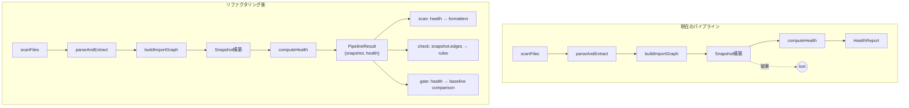

# Architecture Analysis: Pre-Group-G Refactoring Assessment

**Scope**: Full project — pre-implementation check before Group G (Rules Engine, Tasks 32-37)
**Date**: 2026-03-14
**Method**: 3-pass analysis (overview → targeted deep dives → synthesis)

---

## Executive Summary

Group Gの実装（Rules Engine: TOML解析、制約チェック、レイヤー/境界チェック、check/gateコマンド）に進む前に、**3つの構造的摩擦**が特定された。これらを先に解決することで、Group Gの実装がクリーンかつテスト容易になる。

| # | 摩擦 | 重要度 | 影響するタスク |
|---|------|--------|---------------|
| F1 | `executePipeline()`がSnapshotを返さない | 高 | Task 33, 34, 35, 36, 37 |
| F2 | `computeHealth()`が中間結果を捨てている | 中 | Task 33 (constraint checks) |
| F3 | `RulesConfig`型が未定義 | 中 | Task 32, 33, 34, 35 |

---

## Friction F1: executePipeline()がHealthReportしか返さない

### 現状

```
// src/cli/scan.ts:11
export function executePipeline(rootDir: string): HealthReport
```

`executePipeline()`は内部でSnapshotを構築するが、`computeHealth(snapshot)`の結果（HealthReport）のみを返す。Snapshotはスコープ外に出て破棄される。

### なぜ問題か

Group Gの以下のタスクがSnapshotへのアクセスを必要とする：

- **Task 34 (Layer & Boundary Checks)**: `importGraph.edges`を走査してレイヤー方向違反・境界違反を検出する。HealthReportにはedge情報がない
- **Task 37 (Gate Command)**: ベースライン比較にcycle count、coupling score等の生メトリクス値が必要。HealthReportにはrawValueがあるが、Snapshotのグラフ構造なしでは再計算不可
- **Task 35 (Rules Orchestrator)**: `checkRules(config, health, edges)` のシグネチャ（plan記載）がSnapshotのedgesを要求

### リファクタリング提案

```typescript
// Before
export function executePipeline(rootDir: string): HealthReport

// After
export interface PipelineResult {
  readonly snapshot: Snapshot;
  readonly health: HealthReport;
}
export function executePipeline(rootDir: string): PipelineResult
```

`runScan()`は`result.health`のみを使い、check/gateコマンドは`result.snapshot`も使う。

### 影響範囲

- [src/cli/scan.ts](src/cli/scan.ts) — `executePipeline`の戻り値変更
- [src/cli/scan.ts](src/cli/scan.ts) — `runScan`が`result.health`を参照するよう変更
- テスト: [src/cli/scan.test.ts](src/cli/scan.test.ts), [src/cli/index.test.ts](src/cli/index.test.ts)

---

## Friction F2: computeHealth()が中間メトリクス結果を捨てている

### 現状

```typescript
// src/metrics/health.ts:80-139
export function computeHealth(snapshot: Snapshot): HealthReport {
  const cycleResult = detectCycles(importGraph.adjacency);     // CycleResult { cycleCount, cycles[] }
  const godFilesResult = detectGodFiles(fanMaps.fanOut, ...);  // GodFilesResult { godFiles[], count, ratio }
  // ... 他のメトリクスも同様

  // しかし DimensionResult には rawValue (number) しか入らない
  const dimensions: DimensionGrades = {
    cycles: makeDimensionResult("cycles", cycleResult.cycleCount),  // ← cycles[] が失われる
    godFiles: makeDimensionResult("godFiles", godFilesResult.ratio), // ← godFiles[] が失われる
    // ...
  };
}
```

各メトリクス関数は豊富な結果（サイクルのメンバーファイル一覧、God Fileの具体的なファイルパス等）を返すが、`DimensionResult`に変換する際にスカラー値（rawValue）のみが保持され、詳細データが破棄される。

### なぜ問題か

- **Task 33 (Constraint Checks)**: `no_god_files`ルールの違反メッセージに「どのファイルがGod Fileか」を含めたい → HealthReportからは取得不可
- **Task 33**: `max_cc`ルールでCC閾値超えの関数一覧を返したい → HealthReportにはratio(割合)しかない
- `DimensionResult.details?: Record<string, unknown>` フィールドが存在するが、未使用

### リファクタリング提案

**Option A: detailsフィールドを活用する（軽量）**

```typescript
// health.ts の makeDimensionResult に details を追加
dimensions: {
  cycles: {
    name: "cycles",
    rawValue: cycleResult.cycleCount,
    grade: gradeDimension("cycles", cycleResult.cycleCount),
    details: { cycles: cycleResult.cycles },
  },
  godFiles: {
    name: "godFiles",
    rawValue: godFilesResult.ratio,
    grade: gradeDimension("godFiles", godFilesResult.ratio),
    details: { files: godFilesResult.godFiles, count: godFilesResult.count },
  },
  // ...
}
```

**Option B: HealthReportを拡張してメトリクス詳細を別フィールドに持つ（重め）**

Option Aを推奨。既存の`details`フィールドを活用するだけで、型変更なし。

### 影響範囲

- [src/metrics/health.ts](src/metrics/health.ts) — `makeDimensionResult`にdetails引数追加、各メトリクスの詳細を渡す
- テスト: [src/metrics/health.test.ts](src/metrics/health.test.ts) — detailsの検証追加
- フォーマッタへの影響なし（detailsはoptionalなので既存出力に変更なし）

---

## Friction F3: RulesConfig型が未定義

### 現状

[src/types/rules.ts](src/types/rules.ts)には`RuleViolation`と`RuleCheckResult`のみが定義されている。TOMLファイルをパースした後の設定構造体（`RulesConfig`）が存在しない。

### なぜ問題か

Task 32（TOML Parser）の出力型、Task 33-34の入力型として`RulesConfig`が必要。これはGroup Gのタスク32自体で定義すべきもので、**事前リファクタリングとしては型定義の追加のみ**で十分。

### 推奨

これはGroup G Task 32の一部として実装すべき。事前リファクタリングとしては**不要**。Plan通りにTask 32で`RulesConfig`型を定義すれば問題ない。

---

## 追加観察：重複ロジック（低優先度）

### isStable() の重複

- [src/metrics/coupling.ts:9-21](src/metrics/coupling.ts#L9-L21) — `isStable()`
- [src/metrics/health.ts:25-41](src/metrics/health.ts#L25-L41) — `isFoundationFile()`

両方とも instability <= 0.15 && fanIn >= 3 を判定するが、`isFoundationFile`はbarrel fileパターンも含む。完全な重複ではないが、安定性判定のコア部分が二箇所にある。

**判断**: Group G実装には影響しないため、今回のリファクタリング対象外。将来的に`src/metrics/stability.ts`に抽出可能。

---

## リファクタリング計画

### 必須（Group G実装前）

| # | 作業 | ファイル | 工数 |
|---|------|---------|------|
| R1 | `executePipeline()`の戻り値を`PipelineResult`に変更 | scan.ts, scan.test.ts | 小 |
| R2 | `computeHealth()`で`details`フィールドにメトリクス詳細を格納 | health.ts, health.test.ts | 小〜中 |

### 不要（Group Gタスク内で自然に対応）

| # | 作業 | 理由 |
|---|------|------|
| S1 | `RulesConfig`型定義 | Task 32で定義 |
| S2 | check/gate commandスタブの実装 | Task 36, 37で対応 |
| S3 | ルール結果フォーマッタの追加 | Task 36で対応 |

### 延期可（今は不要）

| # | 作業 | 理由 |
|---|------|------|
| D1 | `isStable()`の重複排除 | Group Gに影響なし |

---

## Confidence Boundary

- **分析済み**: src/全モジュール（types, scanner, parser, graph, metrics, grading, cli, utils）
- **未分析**: テストの内容の詳細（テストファイルの存在は確認済み、テスト品質は未検証）
- **前提**: Plan通りの`checkRules(config, health, edges)`シグネチャでRules Engineを実装する

---

## Mermaid: 現在のデータフロー vs 必要なデータフロー


