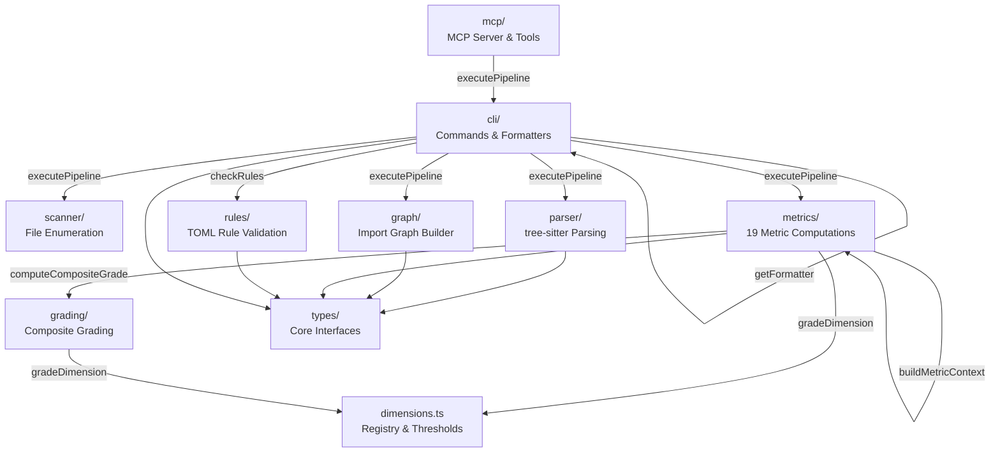
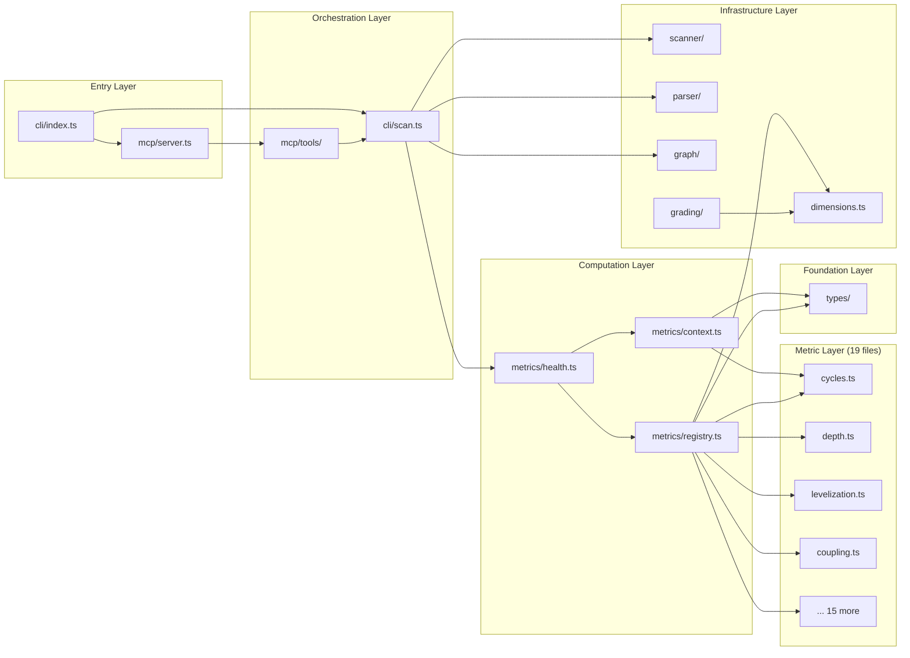

# Architecture Analysis: sekko-arch (Full Project)

_Generated: 2026-03-15. This is a point-in-time snapshot, not a live reference._

## Scope & Approach

**Analyzed**: Full project — all 9 modules under `src/` (cli, parser, graph, metrics, grading, rules, scanner, mcp, utils, types, testing) plus top-level entry points (`dimensions.ts`, `index.ts`, `constants.ts`).

**Method**: Self-scan (sekko-arch scanning itself, 19 dimensions) + Serena symbol analysis + scout exploration. 3 deep dives on top friction areas.

**Self-scan result**: Composite grade **C** (7×A, 2×B, 5×C, 5×D).

## Architecture Overview



| Module | Responsibility | Key Dependencies | Files |
|--------|---------------|-----------------|-------|
| `cli/` | Commander.js commands (scan, check, gate) + table/JSON formatters | scanner, parser, graph, metrics, rules | 14 |
| `metrics/` | 19 metric computations + registry + context builder | types, dimensions, grading | 26 |
| `parser/` | tree-sitter AST parsing, function/class/import extraction | types, tree-sitter | 8 |
| `graph/` | Import graph with adjacency lists via oxc-resolver | types | 3 |
| `scanner/` | File enumeration (git ls-files or fs-walk), line counting | types | 4 |
| `grading/` | A-F grade thresholds, composite grade calculation | dimensions | 3 |
| `rules/` | TOML-based config validation (constraints, layers, boundaries) | types, dimensions | 5 |
| `mcp/` | MCP server for AI-agent integration (6 tools) | cli (executePipeline) | 6 |
| `types/` | Core interfaces (FileNode, Snapshot, HealthReport, etc.) | none | 5 |
| `utils/` | glob matching, module path extraction | none | 2 |

## Dependency Structure



**Deepest import chain (10 levels)**:
`cli/index.ts` → `mcp/server.ts` → `mcp/tools/index.ts` → `mcp/tools/scan.ts` → `cli/scan.ts` → `metrics/health.ts` → `metrics/registry.ts` → `metrics/hotspots.ts` → `metrics/fan-maps.ts` → `types/snapshot.ts` → `types/core.ts`

## Structural Observations

### Friction Area 1: `metrics/registry.ts` — God File (Severity: High)

**What**: 367 LOC, 18 import statements from individual metric files, all 19 `MetricComputation` entries defined inline with detail-collection logic.

**Why it matters**:
- Adding a new dimension requires editing this file, `dimensions.ts`, and creating the metric file — 3-file coordination
- 6 of 19 compute functions contain duplicated detail-collection patterns (iterate `ctx.snapshot.files`, filter by threshold, collect into array): `complexFn` (L92-116), `cognitiveComplexity` (L154-178), `longFunctions` (L189-210), `highParams` (L225-245), `duplication` (L248-276), `largeFiles` (L212-223)
- The file is the sole consumer of all 18 metric functions — maximum fan-out in the codebase

**Refactoring opportunity**: Extract detail-collection logic into each metric function (return details from compute function instead of just raw value). This would reduce registry.ts to ~100 LOC of pure wiring. Each metric becomes self-contained.

### Friction Area 2: Cognitive Complexity Hotspots (Severity: High)

**What**: 6 functions with cognitive complexity > 30:

| File | Function | CC | Cognitive | Lines |
|------|----------|-----|-----------|-------|
| `metrics/cycles.ts` | `detectCycles` | 18 | 60 | 112 |
| `parser/function-extractors.ts` | `extractFunctions` | 21 | 51 | 64 |
| `metrics/levelization.ts` | `computeLevelization` | 34 | 51 | 120 |
| `scanner/line-counter.ts` | `classifyLine` | 20 | 48 | 94 |
| `metrics/depth.ts` | `computeMaxDepth` | 23 | 44 | 104 |
| `parser/cognitive-complexity.ts` | `walk` | — | 35 | — |

**Why it matters**: These functions are hard to modify confidently. `detectCycles` (iterative Tarjan's SCC) and `computeMaxDepth` (iterative DFS with memoization) are algorithmically dense — their complexity is inherent to the algorithm but could be decomposed into helper functions.

**Refactoring opportunity**:
- `classifyLine`: State-machine refactoring — extract comment/string/template-literal state handlers
- `extractFunctions`: Extract AST node-type handlers into a dispatch map
- `computeLevelization`: Split into `assignLevels()` + `countViolations()` sub-functions
- `detectCycles` / `computeMaxDepth`: Extract stack-frame management into reusable iterative DFS utility

### Friction Area 3: `src/utils/` Low Cohesion (Severity: Medium)

**What**: Module contains 2 unrelated files — `glob.ts` (pattern matching, 60 LOC) and `module-of.ts` (path extraction, 22 LOC). Cohesion score = 0 (no internal imports between files).

**Why it matters**: `moduleOf()` is used by `metrics/module-boundary.ts` and `metrics/coupling.ts` — it's a metrics concern. `globMatch()` is used by `scanner/ignore-filter.ts` — it's a scanner concern.

**Refactoring opportunity**: Move `moduleOf()` into `metrics/module-boundary.ts` (or adjacent). Move `globMatch()` into `scanner/`. Delete `utils/` directory. This eliminates the low-cohesion module entirely.

### Additional Observations

**Blast Radius — `metrics/fan-maps.ts`** (18 files reachable, 23%): Small file (25 LOC) but high transitive impact because `FanMaps` is a property of `MetricContext`, which flows to all 19 metrics. This is structural — the interface is clean and stable, so blast radius here is acceptable cost of the MetricContext pattern.

**Depth Chain (10 levels)**: The chain passes through `mcp/tools/scan.ts` → `cli/scan.ts`, which is MCP tools re-using CLI pipeline. The real computational depth is 7 levels (cli/scan → types/core). Reducing depth would require flattening the metrics orchestration (health → context → registry), which trades depth for coupling. Current depth is acceptable.

**`distanceFromMainSeq` D grade — `src/rules/`**: Rules module is concrete (low abstraction) but has no dependents (low instability = 0). It sits far from the main sequence because it's only consumed by `cli/check.ts`. This is by design — rules are optional.

**`attackSurface` D grade**: 73/77 files reachable from entry points. Expected for a CLI tool — the entry point (`cli/index.ts`) transitively reaches the entire codebase. Not actionable.

### Structural Fitness Assessment

The anticipated refactoring targets (cognitive complexity, cohesion, god file) are **well-supported by the current structure**:

1. **Registry decomposition** requires no structural changes — each metric file already exports a dedicated compute function. The refactoring is additive (return details from metric) + subtractive (remove detail logic from registry).
2. **Complex function splitting** is local to individual files — no cross-module changes needed.
3. **Utils dissolution** moves 2 small functions to their natural homes — no interface changes.

**Recommendation**: No pre-restructuring needed. Refactoring can proceed directly on the identified targets.

## Refactoring Plan

### Priority 1: Registry Decomposition (High Impact, Medium Effort)

**Goal**: Reduce `metrics/registry.ts` from 367 LOC to ~100 LOC. Eliminate duplicated detail-collection patterns.

**Approach**: Each metric function returns `{ rawValue, details }` instead of just a number. Registry becomes pure wiring.

**Files to modify**:
- `src/metrics/registry.ts` — slim down to name + compute wiring
- `src/metrics/complex-fns.ts` — return details (complex function list)
- `src/metrics/cognitive-complexity.ts` — return details (complex function list)
- `src/metrics/long-functions.ts` — return details (long function list)
- `src/metrics/high-params.ts` — return details (high-param function list)
- `src/metrics/duplication.ts` — return details (duplicate groups)
- `src/metrics/large-files.ts` — return details (large file list)
- `src/metrics/comments.ts` — return details (comment ratio)
- `src/metrics/blast-radius.ts` — return details (max blast radius file)

**Expected improvement**: godFiles dimension A (registry no longer god file), coupling B→A.

### Priority 2: Complex Function Splitting (High Impact, Medium Effort)

**Goal**: Reduce cognitive complexity of 6 hotspot functions below threshold (≤15).

**Approach by function**:

| Function | Strategy | Target Files |
|----------|----------|-------------|
| `classifyLine` | Extract state handlers for comment/string/template detection | `scanner/line-counter.ts` |
| `extractFunctions` | Dispatch map by AST node type | `parser/function-extractors.ts` |
| `computeLevelization` | Split into `assignLevels()` + `countViolations()` | `metrics/levelization.ts` |
| `detectCycles` | Extract SCC frame logic into helper | `metrics/cycles.ts` |
| `computeMaxDepth` | Extract DFS frame logic into helper | `metrics/depth.ts` |
| `formatDetailItems` | Extract per-dimension formatters into map | `cli/formatters/table.ts` |

**Expected improvement**: cognitiveComplexity D→B, complexFn C→A.

### Priority 3: Utils Module Dissolution (Low Effort, Quick Win)

**Goal**: Eliminate cohesion=0 module.

**Steps**:
1. Move `moduleOf()` from `src/utils/module-of.ts` to `src/metrics/module-boundary.ts`
2. Move `globMatch()` from `src/utils/glob.ts` to `src/scanner/ignore-filter.ts` (or `src/scanner/glob.ts`)
3. Update all import paths (2 files import `moduleOf`, 1 file imports `globMatch`)
4. Move tests accordingly
5. Delete `src/utils/` directory

**Expected improvement**: cohesion D→B.

### Priority 4: Table Formatter Refactoring (Medium Effort)

**Goal**: Reduce `formatDetailItems` from 122 LOC / CC=36 to manageable size.

**Approach**: Create a `DetailFormatter` map keyed by dimension name. Each entry is a small function that formats that dimension's details. Replace the giant switch/if-chain with map lookup.

**Expected improvement**: longFunctions B→A, complexFn contribution reduced.

### Execution Order

```
Phase 1 (Quick wins):
  └─ Priority 3: Utils dissolution (30 min)

Phase 2 (Core refactoring):
  ├─ Priority 1: Registry decomposition (2-3 hours)
  └─ Priority 2a: classifyLine + extractFunctions splitting (1-2 hours)

Phase 3 (Completion):
  ├─ Priority 2b: Remaining complex functions (2-3 hours)
  └─ Priority 4: Table formatter refactoring (1-2 hours)
```

### Expected Final Grades After Refactoring

| Dimension | Before | After | Notes |
|-----------|--------|-------|-------|
| cycles | A | A | No change |
| coupling | B | A-B | Less cross-module coupling from registry |
| depth | C | C | Structural, acceptable |
| godFiles | C | A | Registry no longer god file |
| complexFn | C | A-B | Hotspot functions split |
| levelization | A | A | No change |
| blastRadius | C | C | Structural, acceptable |
| cohesion | D | B | Utils dissolved |
| entropy | D | C-D | Marginal improvement from file splitting |
| cognitiveComplexity | D | B | Hotspot functions decomposed |
| hotspots | A | A | No change |
| longFunctions | B | A | Functions shortened by splitting |
| comments | C | C | Not targeted |
| distanceFromMainSeq | D | D | Structural, by design |
| attackSurface | D | D | Expected for CLI tools |
| **Composite** | **C** | **B** | |

## Confidence Boundary

**Assessed**:
- All 9 source modules + top-level files via Serena symbols + scout + self-scan
- Full dependency chain analysis for metrics pipeline
- Detail-collection pattern duplication in registry.ts (verified by reading full file)
- Utils module contents and their consumers (verified via Serena references)

**NOT assessed**:
- Runtime performance characteristics (scan speed, memory usage)
- Test coverage adequacy (414 tests exist but coverage % unknown)
- E2E test fixture completeness (`src/e2e/fixtures/`)
- MCP session management correctness (`mcp/tools/session.ts` — 178 LOC, not deep-dived)
- Parser correctness for edge cases (tree-sitter grammar coverage)
- TOML rule validation edge cases
