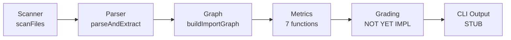
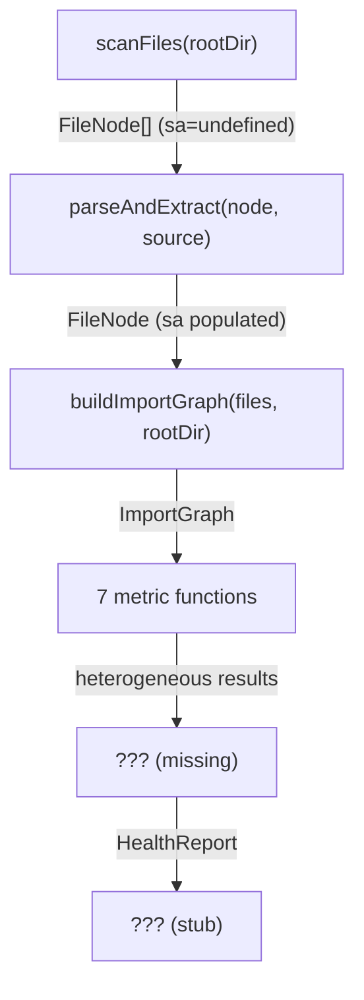
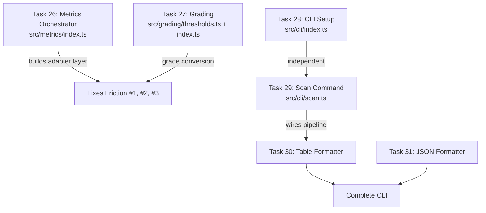

# Architecture Analysis: archana (Full Project)

**Date**: 2026-03-14
**Scope**: Entire project — Groups A-E (done) + Group F-H (pending)
**Anticipated Changes**: Group F implementation (Tasks 26-31: metrics orchestrator, grading, CLI, formatters)

---

## 1. Architecture Overview

archana is a TypeScript CLI tool for architecture quality analysis. It follows a **6-phase immutable pipeline**:



### Module Map

```
src/
├── types/          # Immutable data model (FileNode, Snapshot, HealthReport, Rules)
├── scanner/        # File collection + line counting (git ls-files / fs walk)
├── parser/         # tree-sitter AST → functions, classes, imports, CC
├── graph/          # oxc-resolver import resolution → ImportGraph (adjacency maps)
├── metrics/        # 7 independent metric computations (no orchestrator yet)
├── grading/        # EMPTY — awaiting Group F
├── rules/          # EMPTY — awaiting Group G
├── cli/            # STUB — 3-line placeholder
└── utils/          # moduleOf(), globMatch()
```

### Data Flow



---

## 2. Current Health

| Gate | Status |
|------|--------|
| TypeScript typecheck | PASS |
| Vitest (207 tests, 27 files) | PASS |
| ESLint | PASS |
| Build (tsup) | PASS |

**Code statistics**: ~40 source files, ~27 test files, 5 git commits, all Groups A-E complete.

---

## 3. Component Analysis

### 3.1 Type System (src/types/)

**Quality**: Excellent. Clean readonly immutable types. Well-structured barrel export.

Key types for Group F:
- `DimensionResult { name, rawValue, grade, details? }` — target output per metric
- `DimensionGrades` — all 7 dimensions
- `HealthReport { dimensions, compositeGrade, fileCount, scanDurationMs }` — final output
- `Grade = "A" | "B" | "C" | "D" | "F"`, `GradeValue = 0 | 1 | 2 | 3 | 4`

### 3.2 Scanner (src/scanner/)

**Quality**: Good. Clean orchestrator pattern. git ls-files preferred, fs-walk fallback.

### 3.3 Parser (src/parser/)

**Quality**: Good. tree-sitter integration works. CC computation follows Myers 1977.

### 3.4 Graph (src/graph/)

**Quality**: Good with minor performance concern (see Friction #5).

### 3.5 Metrics (src/metrics/)

**Quality**: Algorithms are correct and well-tested. However, this module has the most friction for Group F integration (see Friction #1, #2, #3).

---

## 4. Friction Areas

### Friction #1: Heterogeneous Metric Return Types (Impact: HIGH)

**Problem**: Each metric function returns a different type. None returns `DimensionResult`.

| Function | Returns |
|----------|---------|
| `detectCycles(adjacency)` | `CycleResult { cycleCount, cycles }` |
| `computeCoupling(edges, modules, fanIn, fanOut)` | `CouplingResult { score, crossModuleEdges, crossModuleToUnstable }` |
| `computeMaxDepth(adjacency)` | `number` (bare primitive) |
| `detectGodFiles(fanOut, entryPoints)` | `string[]` (bare array) |
| `computeComplexFnRatio(functions)` | `number` (bare primitive) |
| `computeLevelization(adjacency, cycles)` | `LevelizationResult { levels, violations, totalEdges, violationRatio }` |
| `computeBlastRadius(reverseAdj, foundation)` | `BlastRadiusResult { maxBlastRadius, maxBlastRadiusRatio, perFile }` |

**Impact on Group F**: The metrics orchestrator (Task 26) must build an adapter layer that:
1. Calls each function with its unique signature
2. Extracts the `rawValue` from each heterogeneous result
3. Applies grading thresholds to produce `DimensionResult`

**Recommendation**: Accept as-is. The adapter pattern in the orchestrator is the right place for this conversion. Refactoring 7 metric functions to return `DimensionResult` would break their independence and leak grading concerns into computation.

### Friction #2: Missing `src/metrics/index.ts` Barrel Export (Impact: MEDIUM)

**Problem**: Every other module has a barrel `index.ts`, but `src/metrics/` does not. Group F orchestrator must import from 9 separate files.

**Recommendation**: Create `src/metrics/index.ts` as part of Task 26 to re-export all metric functions. This also becomes the home for `computeHealth()`.

### Friction #3: `foundationFiles` Parameter Has No Producer (Impact: MEDIUM)

**Problem**: `computeBlastRadius(reverseAdjacency, foundationFiles)` accepts a `ReadonlySet<string>` for foundation exclusion, but nothing in the codebase generates this set. The design doc says to exclude "stable modules, high fan-in files, barrel files."

**Recommendation**: Group F orchestrator should build `foundationFiles` from:
- Files in stable modules (instability I ≤ 0.15, fan-in ≥ 3) — reuse coupling's stability logic
- Barrel files (`index.ts` pattern)

### Friction #4: `computeMaxDepth` and `detectGodFiles` Return Bare Primitives (Impact: LOW)

**Problem**: `computeMaxDepth` returns `number`, `detectGodFiles` returns `string[]`. Other metrics return structured result objects with additional detail.

**Impact**: Minor — the orchestrator can easily extract `rawValue`:
- depth: `rawValue = computeMaxDepth(adj)`
- godFiles: `rawValue = godFiles.length / totalFiles` (ratio needed for grading)

### Friction #5: `ResolverFactory` Recreated Per File (Impact: LOW)

**Problem**: `resolveImports()` in `src/graph/resolver.ts` creates a `new ResolverFactory()` on every call. For 5,000 files this is wasteful.

**Recommendation**: Not blocking for Group F. Address in Group H (performance validation, Task 39) if benchmarks show it's a bottleneck.

### Friction #6: Dead Code in Levelization (Impact: LOW)

**Problem**: `sccInDegree` map is computed but never read in `src/metrics/levelization.ts` (~line 40-44).

**Recommendation**: Remove during Group F or H. Low priority.

### Friction #7: Test Co-location vs Rules (Impact: INFORMATIONAL)

**Problem**: Tests are co-located with source files (`src/metrics/cycles.test.ts` next to `cycles.ts`). This contradicts the project's `RULES.md` ("No Scattered Tests"). However, this is the established pattern across all 27 test files and the vitest config expects `src/**/*.test.ts`.

**Recommendation**: Accept as-is. Changing now would be high-churn, low-value. The pattern is consistent within the project even if it contradicts the global rules.

---

## 5. Group F Integration Blueprint

Based on friction analysis, here's how Group F tasks should address each issue:



### Grading Thresholds (from Design Doc §4.3)

| Dimension | A | B | C | D | F |
|-----------|---|---|---|---|---|
| cycles | 0 | 1 | 2-3 | 4-6 | 7+ |
| coupling | ≤0.20 | ≤0.35 | ≤0.50 | ≤0.70 | >0.70 |
| depth | ≤5 | ≤8 | ≤10 | ≤15 | >15 |
| godFiles | 0 | ≤0.01 | ≤0.03 | ≤0.05 | >0.05 |
| complexFn | ≤0.02 | ≤0.05 | ≤0.10 | ≤0.20 | >0.20 |
| levelization | 0 | ≤0.02 | ≤0.05 | ≤0.10 | >0.10 |
| blastRadius | ≤0.10 | ≤0.20 | ≤0.35 | ≤0.50 | >0.50 |

**Composite**: `min(floor(mean(all_dimension_values)), worst_dimension + 1)`

---

## 6. Confidence Boundary

### Assessed
- All source code in src/ (types, scanner, parser, graph, metrics, utils)
- All 27 test files — coverage patterns and edge cases
- Design doc grading thresholds and composite formula
- Build/test/lint configuration
- Dependency health (package.json)

### NOT Assessed
- Runtime performance at scale (5,000 files) — deferred to Task 39
- tree-sitter native binding compatibility across platforms
- oxc-resolver edge cases with complex tsconfig configurations
- Worker threads parallelization (not yet implemented, mentioned in design doc)
- Real-world grading threshold calibration (Task 39 area)

---

## 7. Summary

| Category | Count |
|----------|-------|
| Components analyzed | 7 modules |
| Friction areas | 7 (1 HIGH, 2 MEDIUM, 3 LOW, 1 INFO) |
| Blocking issues for Group F | 0 |
| Refactoring recommended before Group F | 0 |

**Bottom line**: The codebase is clean and well-tested. No refactoring is needed before Group F. All friction areas are addressable within Group F tasks themselves, particularly Task 26 (metrics orchestrator) which is the natural home for the adapter layer that bridges heterogeneous metric outputs to the uniform `DimensionResult` type.
