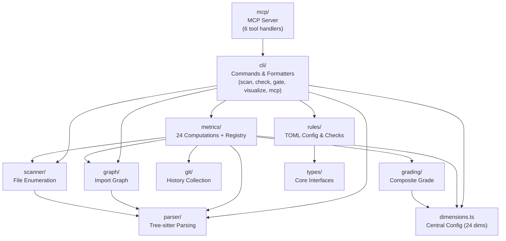

# Architecture Analysis: sekko-arch (Thorough Mode)

_Generated: 2026-03-15. This is a point-in-time snapshot, not a live reference._

## Scope & Approach

**Scope**: Full project — all source modules under `src/` (parser, graph, metrics, grading, cli, mcp, scanner, rules, git, types, testing, e2e).

**Method**: Serena symbol hierarchy scan (14 key files, depth=1) + reference chain analysis (5 hub symbols) + Scout agent broad exploration (file sizes, import patterns, duplication, naming).

**Content type**: `code` (pure TypeScript, no document directories).

## Architecture Overview



| Component | Responsibility | Key Dependencies | Lines (non-test) |
|-----------|---------------|-----------------|-------------------|
| `dimensions.ts` | Central config for 24 dimensions (thresholds, categories, labels) | None | 404 |
| `metrics/registry.ts` | Maps 24 dimension names to compute functions | All 24 metric files, dimensions.ts | 322 |
| `metrics/context.ts` | Builds shared MetricContext for all computations | fan-maps, module-boundary, cycles, scanner | 94 |
| `metrics/health.ts` | Orchestrates all 24 computations → HealthReport | registry, context | 39 |
| `cli/scan.ts` | Pipeline: scan → parse → graph → health | scanner, parser, graph, git, health | 91 |
| `cli/html-generator.ts` | Self-contained HTML report (Treemap + DSM) | None (pure template) | 320 |
| `cli/formatters/table.ts` | Terminal table output with category headers | dimensions.ts | 268 |
| `cli/gate.ts` | Baseline save/compare for CI gating | scan, dimensions | 209 |
| `mcp/` | MCP server (stdio) with tool dispatch | cli/scan (executePipeline) | 283 total |
| `parser/` | Tree-sitter extraction (imports, functions, classes, complexity) | tree-sitter, tree-sitter-typescript | ~530 |
| `graph/` | Import graph construction (oxc-resolver) | parser | ~200 |
| `scanner/` | File enumeration (git ls-files / fs walk) + filtering | picomatch | ~530 |
| `git/` | Git history collection (git log --numstat) | child_process | ~200 |
| `rules/` | TOML parsing + rule checking (constraints, boundaries, layers) | smol-toml, types | ~430 |
| `grading/` | Composite grade computation | dimensions.ts | ~50 |

## Dependency Structure

```mermaid
graph LR
    subgraph "Pipeline Flow"
        scan["cli/scan.ts<br/>executePipeline"]
        scanner["scanner/"]
        parser["parser/"]
        graph["graph/"]
        git["git/"]
        ctx["metrics/context.ts"]
        reg["metrics/registry.ts"]
        health["metrics/health.ts"]
    end

    scan --> scanner
    scan --> parser
    scan --> graph
    scan --> git
    scan --> health
    health --> ctx
    health --> reg
    reg --> |"24 imports"| metrics24["24 metric files"]
    ctx --> |"6 helper calls"| helpers["fan-maps, module-boundary,<br/>cycles, stability, scanner"]
    metrics24 --> ctx

    subgraph "Consumers of executePipeline"
        cli_cmds["cli: scan, check, gate, visualize"]
        mcp_tools["mcp: scan, health, coupling, cycles, session"]
    end

    cli_cmds --> scan
    mcp_tools --> scan
```

## Structural Observations

### 1. MetricContext as God Object (HIGH)
**File**: `src/metrics/context.ts:62-93` (`buildMetricContext`)
**What**: MetricContext bundles 10 fields (snapshot, cycleResult, fanMaps, moduleAssignments, allFunctions, entryPoints, foundationFiles, filePaths, gitHistory, evolutionConfig). Every metric computation receives the full context, though most use only 2-3 fields.
**Why it matters**: Violates Interface Segregation — adding/changing a field impacts all 24 metrics. The function also has implicit ordering dependencies (fanMaps must exist before foundationFiles).
**Refactoring opportunity**: Split into category-specific sub-contexts (e.g., `GraphContext`, `GitContext`, `FileContext`) or use a lazy-evaluation pattern where fields are computed on demand.

### 2. Registry Import Fan-Out (MEDIUM)
**File**: `src/metrics/registry.ts` (322 lines, 27 imports)
**What**: Imports all 24 compute functions explicitly and builds METRIC_COMPUTATIONS array. Runtime validation (line 317) catches mismatches but no compile-time enforcement.
**Why it matters**: Adding a new dimension requires touching 5 files (dimensions.ts, registry.ts, new metric file, fixtures.ts, table.ts). Tight coupling between registry and every metric.
**Refactoring opportunity**: Auto-discovery pattern or co-located registration (each metric file exports a `MetricComputation` object, registry collects via barrel imports).

### 3. Git-Based Metric Duplication (MEDIUM)
**Files**: `code-churn.ts` (36L), `change-coupling.ts` (65L), `bus-factor.ts` (38L), `code-age.ts` (45L)
**What**: All 4 follow identical pattern: check `gitHistory === undefined` → extract data → compute ratio → return DimensionResult. The undefined-check and empty-result construction is duplicated.
**Refactoring opportunity**: Extract `withGitHistory(ctx, computeFn)` wrapper that handles the guard clause and empty result, reducing each metric to just its computation logic.

### 4. HTML Generator Monolith (MEDIUM)
**File**: `src/cli/html-generator.ts` (320 lines)
**What**: `generateReportHtml()` returns a single template string with embedded D3.js Treemap rendering, DSM matrix rendering, tab switching, tooltips, and event handlers. All visualization logic is inlined.
**Why it matters**: Untestable JS logic (only tested via string matching on HTML output). Adding a new viz requires editing this single function.
**Refactoring opportunity**: Extract Treemap JS and DSM JS into separate template functions. Or move to external .js files bundled at build time.

### 5. Scattered Threshold Ownership (MEDIUM)
**Files**: `src/dimensions.ts` (grading thresholds in DIMENSION_REGISTRY), `src/metrics/thresholds.ts` (7 detection constants), `src/grading/thresholds.ts` (3-line re-export shim)
**What**: Two distinct threshold concepts (grading vs. detection) live in different files with no clear naming distinction. `grading/thresholds.ts` is a dead re-export.
**Refactoring opportunity**: Remove `grading/thresholds.ts` shim. Rename `metrics/thresholds.ts` to `metrics/detection-thresholds.ts` to clarify purpose.

### 6. Table Formatter Detail Map Coupling (MEDIUM)
**File**: `src/cli/formatters/table.ts:64-170` (DETAIL_FORMATTERS)
**What**: 24-entry Record mapping each dimension to a custom formatting closure. Tightly coupled to metric detail shapes — changes in metric output require matching changes here.
**Refactoring opportunity**: Each metric could export a `formatDetail` function alongside `compute`, making the formatter a simple dispatch.

### 7. executePipeline Fan-In (LOW-MEDIUM)
**File**: `src/cli/scan.ts:26-75` (executePipeline)
**What**: 11 callers across cli/ and mcp/tools/. Single entry point for all analysis.
**Why it matters**: Acceptable today, but future pipeline variants (incremental scan, partial analysis) would need to fork or parameterize this function.

### 8. Dead Re-export Shim (LOW)
**File**: `src/grading/thresholds.ts` (3 lines)
**What**: `export { gradeDimension, gradeToValue, valueToGrade } from "../dimensions.js"` — backward-compat shim with no active importers.
**Refactoring opportunity**: Delete file, update any remaining imports.

### Structural Fitness Assessment

The current structure supports refactoring well — each metric is isolated in its own file, types are cleanly separated, and the pipeline is linear. However, MetricContext coupling and registry centralization mean structural changes to the metric system require coordinated multi-file edits.

## Debt Inventory

| # | Item | Description | Affected Files | Ref Count | Coupled Modules | Refactoring Direction |
|---|------|-------------|---------------|-----------|-----------------|----------------------|
| 1 | MetricContext god object | 10-field context passed to all 24 metrics; most use 2-3 fields | 26 | 3 | 6 | Split into category sub-contexts or lazy fields |
| 2 | Registry import fan-out | 27 explicit imports, 24 METRIC_COMPUTATIONS entries | 25 | 4 | 24 | Auto-discovery or co-located registration |
| 3 | Git metric duplication | Identical guard clause + result pattern in 4 evolution metrics | 4 | 0 | 1 | Extract `withGitHistory()` wrapper |
| 4 | HTML generator monolith | 320 lines of embedded JS in template string | 1 | 2 | 0 | Extract viz into separate template functions |
| 5 | Scattered thresholds | Grading vs detection thresholds in 3 files, unclear naming | 3 | Multiple | 2 | Delete shim, rename detection thresholds |
| 6 | Table formatter coupling | 24-entry DETAIL_FORMATTERS map coupled to metric detail shapes | 1 | 0 | 24 | Co-locate formatters with metrics |
| 7 | executePipeline fan-in | Single pipeline entry with 11 callers | 11 | 11 | 9 | Parameterize for future variants |
| 8 | Dead re-export shim | grading/thresholds.ts is unused backward-compat | 1 | 0 | 1 | Delete file |

## Impact Assessment (Phase 2)

### Deep Dive Results

All 8 debt items were analyzed in detail by reading full source code and tracing reference chains.

#### Items Refactored

| # | Item | Action Taken | Verification |
|---|------|-------------|--------------|
| 8 | Dead re-export shim | Deleted `src/grading/thresholds.ts`. Updated `grading/thresholds.test.ts` to import directly from `dimensions.ts` (282 lines of real tests preserved). | 714 tests pass |
| 5 | Scattered thresholds | Renamed `metrics/thresholds.ts` → `metrics/detection-thresholds.ts`. Updated 9 importing files. Deleted dead grading shim. | 714 tests pass, typecheck clean |
| 4 | HTML generator monolith | Extracted `generateTreemapScript()`, `generateDsmScript()`, `generateAppScript()` from monolithic template. Same file, same output, better readability. | 11/11 html-generator tests pass |

#### Items Assessed and Intentionally Preserved

| # | Item | Assessment |
|---|------|-----------|
| 1 | MetricContext god object | At 94 lines with 10 fields, the context is compact and the build order is logical. Splitting into sub-contexts would add type complexity to all 24 metrics' signatures without meaningful decoupling benefit. The ISP violation is theoretical — no metric is harmed by receiving unused fields. **Keep as-is.** |
| 2 | Registry import fan-out | Explicit imports enable IDE navigation and rename refactoring. Auto-discovery in TypeScript ESM is complex (no `require.context`). The 5-file ceremony for a new dimension is documented and test-enforced. **Keep as-is.** |
| 3 | Git metric duplication | Each metric checks a different gitHistory field (fileChurns, fileAuthors, fileLastModified, commits). A shared wrapper would need generics or lose type safety. The guard is 1 line per metric. **Keep as-is — duplication is minimal and intentional.** |
| 6 | Table formatter coupling | DETAIL_FORMATTERS correctly separates display from computation. Co-locating formatters with metrics would create circular dependency risk (metrics → types/metrics, table → metrics). **Keep as-is.** |
| 7 | executePipeline fan-in | 11 callers is appropriate for a single pipeline entry point. Parameterization for future variants can be added when needed (YAGNI). **Keep as-is.** |

## Confidence Boundary

**Assessed**:
- All source modules under `src/` (symbol hierarchy + file sizes)
- Cross-file reference chains for 5 hub symbols
- Import patterns and duplication in git-based metrics
- Threshold ownership across 3 files

**NOT assessed**:
- Runtime performance characteristics (no profiling)
- Test coverage adequacy (tests exist but coverage % not measured)
- E2E test fixture completeness
- Build/bundle configuration (tsup config)
- Actual cyclomatic complexity of individual functions
- Security surface of MCP server tool handlers
