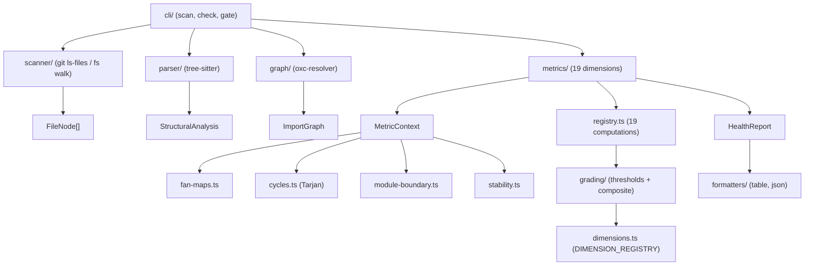
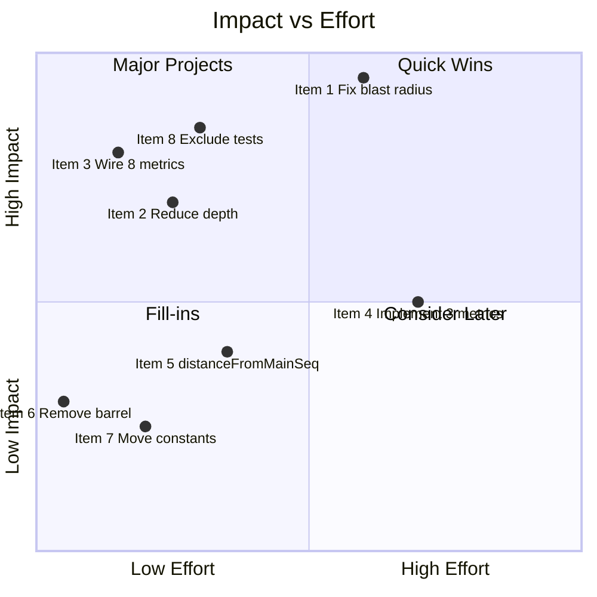

# sekko-arch Architecture Analysis (Thorough)

**Scope**: Project全体
**Date**: 2026-03-14
**Mode**: Thorough (Phase 1 + Phase 2)

---

## 1. Self-Diagnostic Results (sekko-arch scan .)

| Dimension | Raw Value | Grade | Status |
|-----------|-----------|-------|--------|
| Cycles | 1 | B | 循環依存1件 |
| Coupling | 0.14 | A | 良好 |
| **Depth** | **11** | **D** | 要改善 |
| God Files | 0.00 | A | 良好 |
| Complex Fns | 0.04 | B | 良好 |
| Levelization | 0.01 | B | 良好 |
| **Blast Radius** | **0.51** | **F** | 最重要課題 |
| Cohesion | 0.00 | A | STUB (未実装) |
| Entropy | 0.00 | A | STUB (未実装) |
| Cognitive Complexity | 0.00 | A | STUB (実装済み未接続) |
| Hotspots | 0.00 | A | STUB (実装済み未接続) |
| Long Functions | 0.00 | A | STUB (実装済み未接続) |
| Large Files | 0.00 | A | STUB (実装済み未接続) |
| High Params | 0.00 | A | STUB (実装済み未接続) |
| Duplication | 0.00 | A | STUB (実装済み未接続) |
| Dead Code | 0.00 | A | STUB (実装済み未接続) |
| Comments | 0.00 | A | STUB (実装済み未接続) |
| Distance from Main Seq | 0.00 | A | STUB (部分実装) |
| Attack Surface | 0.00 | A | STUB (未実装) |
| **Composite** | — | **D** | Blast Radius F に引っ張られている |

**131ファイル / 1.69ms** (注: 56テストファイルを含む — Item #8 参照)

---

## 2. Architecture Overview

### 2.1 Pipeline Architecture



### 2.2 Module Inventory

| Module | Files | Non-Test LOC | Purpose | Coupling |
|--------|-------|-------------|---------|----------|
| types/ | 5 | 177 | Core型定義 | Fan-out: 40+ファイルが依存 |
| parser/ | 8 | 592 | AST解析・抽出 | tree-sitter依存 |
| metrics/ | 26 | 1,067 | メトリクス計算 | 最大モジュール |
| graph/ | 3 | 127 | 依存グラフ構築 | oxc-resolver依存 |
| scanner/ | 4 | 115 | ファイル列挙 | git/fs依存 |
| cli/ | 8 | 198 | CLI I/F | 全モジュールを統合 |
| grading/ | 3 | 86 | グレード算出 | dimensions.ts依存 |
| rules/ | 5 | 217 | TOML制約検証 | 独立性高い |
| utils/ | 2 | 82 | ユーティリティ | 低結合 |
| testing/ | 1 | 183 | テストフィクスチャ | テスト専用 |

**Total**: 69ファイル, 3,924 non-test LOC, 6,426 test LOC

### 2.3 Design Patterns

1. **Registry Pattern**: `DIMENSION_REGISTRY` (dimensions.ts) + `METRIC_COMPUTATIONS` (registry.ts)
2. **Context Object Pattern**: `MetricContext` で高コスト計算を一度だけ実行
3. **Pipeline Pattern**: `executePipeline()` で4段階を直列実行
4. **Facade Pattern**: `computeHealth()` がメトリクス計算の単一エントリポイント
5. **Barrel Export Pattern**: 各モジュールの index.ts による再エクスポート

---

## 3. Root Cause Analysis

### 3.1 Blast Radius: F (0.51)

**Root Cause**: `src/types/snapshot.ts`（20行の型定義ファイル）が原因。

- **直接依存**: 3ファイル
- **推移的依存**: 67/131ファイル（51.1%）
- types/index.ts がバレルエクスポートとして34ファイルに配信
- MetricContext 経由で全メトリクス計算に Snapshot が流れる

**Impact Chain**:
```
types/snapshot.ts → types/index.ts → 34 modules (barrel consumers)
                 → graph/import-graph.ts → metrics/* → cli/*
Distance 1: 3 files | Distance 2: 34 files | Distance 3: 29 files | Distance 4: 1 file
```

**次点の高 Blast Radius ファイル**: grading/thresholds.ts, metrics/fan-maps.ts, metrics/stability.ts (各20ファイル) — snapshot.ts の 3.35倍少ない。

### 3.2 Depth: D (11)

**Root Cause**: パイプラインの多層構造 + グレーディング依存チェーン。

**最長importチェーン**:
```
cli/scan.ts (0)
  → metrics/index.ts (1)  ← バレル間接層
    → metrics/health.ts (2)
      → metrics/context.ts (3)
        → metrics/stability.ts (4)
          → constants.ts (5)  ← ルートレベル定数
      → grading/grade.ts (3)
        → grading/thresholds.ts (4)  ← ディレクトリ跨ぎ
          → dimensions.ts (5)
```

### 3.3 Metrics Stub Disconnect

**12/19メトリクスが rawValue=0 を返している問題**:

| カテゴリ | メトリクス | 状況 |
|----------|-----------|------|
| **実装済み・未接続** (8) | cognitiveComplexity, hotspots, longFunctions, largeFiles, highParams, duplication, deadCode, comments | 実装コードとテストが存在するが、registry.ts で `stubComputation()` が使われ実関数が呼ばれない |
| **部分実装** (1) | distanceFromMainSeq | stability.ts にヘルパー関数のみ存在、トップレベル計算関数なし |
| **未実装** (3) | cohesion, entropy, attackSurface | 実装ファイル自体が存在しない |

---

## 4. Phase 2: Deep-Dive Analysis

### 4.1 Item #1 — Blast Radius F: 改善戦略

#### 原因の詳細

`types/index.ts` が4つの型ファイルをバレルエクスポートし、34ファイルがそこからimport。これにより、`snapshot.ts` の変更が全34ファイル + その依存先に推移的に波及する構造。

**既に直接importを使っているモジュール**（パターン確認済み）:
- parser/ → `types/core.js` から直接import (5ファイル)
- grading/ → `types/metrics.js` から直接import (4ファイル)
- rules/ (一部) → `types/rules.js` から直接import (2ファイル)
- graph/ → `types/snapshot.js` から直接import (1ファイル)

**バレル経由のまま**: metrics/ (15ファイル), rules/ (8ファイル), cli/ (4ファイル), scanner/ (1ファイル), testing/ (1ファイル), graph/ (3ファイル)

#### 改善オプション比較

| Option | 内容 | Risk | 変更ファイル数 | 予想改善 |
|--------|------|------|-------------|---------|
| **A: Targeted Imports** | バレル経由を直接importに変更 | LOW | 34 | F→C (0.25-0.35) |
| B: Fine-Grained Barrels | 用途別の小さなバレルを新設 | MEDIUM | 34 + 4新規 | F→C (0.20-0.30) |
| C: Interface Segregation | Snapshot型を分割 | HIGH | 15+ | 限定的 (10-15%) |
| D: Lazy Context | MetricContext構築を遅延化 | HIGHEST | 3-4 | F→C (0.20-0.30) |

#### 推奨: Option A (Targeted Imports)

**理由**:
1. 最もリスクが低い（import pathの変更のみ、ロジック変更なし）
2. 既存パターンに合致（parser/, grading/が既に実践）
3. 即時効果（34ファイルのimportを具体的な型ファイルに向ければ、バレル経由の推移的依存が消失）

**具体的な変更マップ**:
```
metrics/*.ts:  FuncInfo, FileNode → ../types/core.js
               ImportEdge → ../types/snapshot.js
               DimensionName, HealthReport → ../types/metrics.js

rules/*.ts:    BoundaryConfig, RuleViolation → ../types/rules.js
               ImportEdge → ../types/snapshot.js
               HealthReport → ../types/metrics.js

cli/*.ts:      Grade, HealthReport → ../types/metrics.js
               FileNode → ../types/core.js
               Snapshot → ../types/snapshot.js
```

---

### 4.2 Item #2 — Depth D: 改善戦略

#### 原因の詳細

深度11の主因は **3つの冗長な間接層**:

1. `metrics/index.ts` バレル → `health.ts` への1レベル間接
2. `grading/thresholds.ts` → `dimensions.ts` のディレクトリ跨ぎ（`gradeDimension()` と `DIMENSION_REGISTRY` の分離）
3. `stability.ts` → `constants.ts` のルートレベル依存

#### 推奨: Option 1 + Option 4 (2段階)

**Step 1**: `grading/thresholds.ts` を `dimensions.ts` に統合
- `gradeDimension()`, `gradeToValue()`, `valueToGrade()` を移動
- `GRADE_TO_VALUE`, `VALUE_TO_GRADE` マップも移動
- dimensions.ts: 266行 → ~310行（許容範囲）
- 影響: `registry.ts` のimportを1行変更
- **深度削減: -1〜2レベル**

**Step 2**: `metrics/index.ts` バレルを除去、直接import
- `cli/scan.ts` が唯一のバレル利用者
- `import { computeHealth } from "../metrics/health.js"` に変更
- **深度削減: -1レベル**

**合計期待値**: Depth 11 (D) → 8-9 (C)
**変更ファイル数**: 2-3
**所要時間**: ~15分
**リスク**: 非常に低い（全exportは再エクスポートで維持可能）

---

### 4.3 Item #3 — 8メトリクス未接続: Wiring Plan

#### 現状

`registry.ts` の `METRIC_COMPUTATIONS` 配列で、8つの実装済みメトリクスが `stubComputation()` で置換されている。実装関数は各ファイルに存在し、テストも通過済み。

#### Wiring手順

**Step 1**: import追加 (registry.ts)
```typescript
import { computeCognitiveComplexityRatio } from "./cognitive-complexity.js";
import { computeHotspotRatio } from "./hotspots.js";
import { computeLongFunctionRatio } from "./long-functions.js";
import { computeLargeFileRatio } from "./large-files.js";
import { computeHighParamsRatio } from "./high-params.js";
import { computeDuplicationRatio } from "./duplication.js";
import { computeDeadCodeRatio } from "./dead-code.js";
import { computeCommentRawValue } from "./comments.js";
```

**Step 2**: stubComputation()を実装に置換

各メトリクスの `MetricContext` フィールド互換性:

| Metric | 必要なctxフィールド | 存在? |
|--------|-------------------|-------|
| cognitiveComplexity | `ctx.allFunctions` | Yes |
| hotspots | `ctx.fanMaps` | Yes |
| longFunctions | `ctx.allFunctions` | Yes |
| largeFiles | `ctx.snapshot.files` | Yes |
| highParams | `ctx.allFunctions` | Yes |
| duplication | `ctx.allFunctions` | Yes |
| deadCode | `ctx.snapshot.importGraph.reverseAdjacency`, `ctx.entryPoints`, `ctx.snapshot.files` | Yes |
| comments | `ctx.snapshot.files` | Yes |

**MetricContext変更不要** — 全実装が既存フィールドで動作する。

**工数**: ~30分（import追加 + stub置換 + テスト確認）

---

### 4.4 Item #4 — 3メトリクス未実装

#### 必要な新規実装

**cohesion** — モジュール内凝集度
- アルゴリズム: モジュール内のintra-module edge数 / (N-1) の最小値
- 反転: `1 - minCohesion` (高凝集 → 低rawValue → A)
- 必要データ: `ctx.snapshot.importGraph.edges`, `ctx.moduleAssignments`

**entropy** — 依存分布のShannnonエントロピー
- アルゴリズム: 各モジュールへのedge数の確率分布からH = -Σ(p_i * log2(p_i))
- log2(N)で正規化して[0,1]に
- 必要データ: `ctx.snapshot.importGraph.edges`, `ctx.moduleAssignments`

**attackSurface** — エントリポイントからの到達可能ファイル率
- アルゴリズム: エントリポイントからBFS → 到達可能ファイル数 / 全ファイル数
- 必要データ: `ctx.snapshot.importGraph.adjacency`, `ctx.entryPoints`, `ctx.snapshot.totalFiles`

**工数**: 各1-2時間（実装 + テスト）

---

### 4.5 Item #5 — distanceFromMainSeq 部分実装

#### 現状

`stability.ts` に `isStable()` と `computeInstability()` ヘルパーが存在するが、Robert C. Martin の Distance from Main Sequence 計算（`D = |A + I - 1|`）のトップレベル関数がない。

#### 必要な実装

```
D = |Abstractness + Instability - 1|
  A = (interfaces + type-aliases) / totalClasses  (per module)
  I = fanOut / (fanIn + fanOut)                    (per module)
```

- `ClassInfo.kind` に `"interface"` / `"type-alias"` が既に含まれている
- FanMaps から fanIn/fanOut 取得可能
- moduleAssignments でモジュール単位に集約

**工数**: ~1時間

---

### 4.6 Item #6 — metrics/index.ts バレル

#### 詳細

`metrics/index.ts` は22シンボルを11ファイルから再エクスポート。利用者は **`cli/scan.ts` の1行のみ**。

#### 推奨

`cli/scan.ts` のimportを直接 `metrics/health.js` に変更し、バレルを削除。

```diff
- import { computeHealth } from "../metrics/index.js";
+ import { computeHealth } from "../metrics/health.js";
```

**深度削減**: -1レベル
**リスク**: 非常に低い
**工数**: 5分

---

### 4.7 Item #7 — constants.ts の位置

#### 詳細

`constants.ts` は9つのメトリクス固有閾値を定義。9ファイルがここからimport。メトリクスモジュールからルートレベルへの上向き依存を生み出している。

#### 推奨: `metrics/thresholds.ts` に移動

```
現在: metrics/stability.ts → ../constants.ts (ルート)
変更: metrics/stability.ts → ./thresholds.ts (同モジュール内)
```

- 9ファイルのimportパスを変更
- `constants.ts` は空になり削除可能
- metrics/ が自己完結的になる

**深度削減**: -1レベル（stability → constants チェーン解消）
**工数**: ~30分

---

### 4.8 Item #8 — テストファイルのスキャン混入 (重要発見)

#### 発見

**131ファイル中56ファイル（43%）がテストファイル** (`.test.ts`) であり、プロダクションコードと同等にスキャンされている。

スキャナー (`scanner/git-files.ts`, `scanner/fs-walk.ts`) は `.ts`/`.tsx` 拡張子のみでフィルタリングし、テストファイルの除外ロジックがない。

#### メトリクスへの影響

| Metric | 影響 | 深刻度 |
|--------|------|--------|
| **Import Graph** | テストのimportがエッジ数を膨張。テスト→ソースの逆エッジが発生 | HIGH |
| **Blast Radius** | 分母131が実質75に。テストがソースをimportするため fan-in 増加 | HIGH |
| **Coupling** | テスト→ソースのクロスモジュールエッジが結合度を汚染 | HIGH |
| **Depth** | テストのimportチェーンが深度を延長する可能性 | MEDIUM |
| **Levelization** | テストがレイヤーを跨いでimport → 違反検出 | HIGH |
| **Complex Fns** | テストファクトリーの複雑度がカウントされる | LOW |

#### 推奨

スキャナーにテストファイル除外フィルタを追加:

```typescript
const TEST_FILE_PATTERN = /\.test\.(ts|tsx)$/;

function isProductionFile(filePath: string): boolean {
  return !TEST_FILE_PATTERN.test(filePath);
}
```

**注意**: 既存のベースライン（gate --save）がテスト込みで保存されている場合、再キャリブレーションが必要。

**工数**: ~1時間（実装 + テスト + ドキュメント）

---

## 5. Refactoring Priority Matrix



### 推奨実行順序

| Phase | Items | 効果 | 工数 |
|-------|-------|------|------|
| **Phase A** (即時) | #3 Wire 8 metrics + #6 Remove barrel | 正確な診断結果 + 深度-1 | ~35分 |
| **Phase B** (短期) | #8 Exclude tests + #2 Reduce depth | メトリクス信頼性回復 + 深度D→C | ~1.5時間 |
| **Phase C** (中期) | #1 Fix blast radius (Option A) | Blast Radius F→C | ~2時間 |
| **Phase D** (中期) | #5 distanceFromMainSeq + #7 Move constants | 完全な安定性メトリクス | ~1.5時間 |
| **Phase E** (長期) | #4 Implement cohesion/entropy/attackSurface | 19/19次元完全稼働 | ~4-6時間 |

### 期待される最終スコア

| Dimension | Before | After Phase A-C | After All |
|-----------|--------|-----------------|-----------|
| Blast Radius | F (0.51) | C (~0.30) | C (~0.30) |
| Depth | D (11) | C (8-9) | B-C (7-9) |
| Composite | D | C | B-C |
| Active Metrics | 7/19 | 15/19 | 19/19 |

---

## 6. Confidence Boundary

### 評価済み
- パイプライン構造と依存関係の完全マッピング
- 全19メトリクスの実装状態と接続性
- Blast Radius / Depth の root cause + 具体的修正パス
- 型システムとデータフロー
- Registry パターンの整合性
- テストファイル混入の影響分析
- 各改善オプションのリスク・工数・効果の定量評価

### 未評価
- ランタイムパフォーマンス（メモリ使用量、大規模プロジェクトでのスケーラビリティ）
- エッジケース処理（壊れたTypeScriptファイル、巨大モノレポ）
- oxc-resolver / tree-sitter のバージョン互換性
- Windows 環境でのパス処理
- JavaScript ファイル（.js/.jsx）のパーサー対応
- テストファイル除外後の正確なメトリクス予測値
