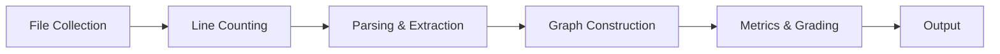
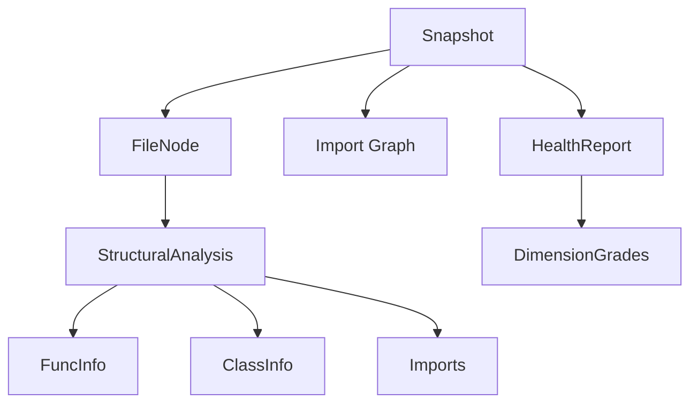

# Design Doc: archana Milestone 1 — CLI + アーキテクチャ品質メトリクス

## 1. 概要

archanaは、TypeScriptコードベースのアーキテクチャ品質を定量的に計測・採点するCLIツールである。tree-sitterによる構文解析とoxc-resolverによるimport解決で依存グラフを構築し、7つのメトリクスをA-Fで採点する。Milestone 1では、TypeScriptプロジェクト（最大5,000ファイル）に対する完全な解析パイプラインと、CI統合用のscan/check/gateコマンドを提供する。

## 2. 背景と動機

### 2.1 問題: AI支援開発における空間認識の喪失

人間の開発者はIDEのファイルツリーやコードナビゲーションを通じて、プロジェクトの依存構造を空間的にマッピングしていた。循環依存やレイヤー違反は、この空間認識を通じて自然に検出されていた。

AIコーディングエージェントにはこの空間認識がない。エージェントはファイルを平面的に処理し、個々のファイル内では正しいコードを生成するが、その変更がシステム全体の構造に与える影響を判断できない。結果として、セッションを重ねるごとにアーキテクチャが劣化する。劣化した構造はエージェントのコンテキスト理解をさらに困難にし、品質劣化が加速するという悪循環を生む。

この問題は、エージェントの能力不足ではなく、構造品質に関する定量的フィードバックの不在に起因する。計測可能なメトリクスとしてフィードバックを提供すれば、人間もエージェントも構造劣化を検出し、修正できる。

### 2.2 既存手段が不十分な理由

3つの代替案を評価し、いずれも却下した。

**sentruxのfork**: sentruxは同じ問題領域をカバーするRust製ツールだが、セキュリティ監査でテレメトリ送信やチェックサム未検証のネイティブバイナリ動的ロードが発見された。テレメトリ削除だけでは将来のアップデートにおけるリスク混入を排除できない。他者のコードに対する完全な把握と信頼の確保は、fork後も本質的に困難である。

**既存ツール群の組み合わせ（dependency-cruiser + madge + ESLint）**: 各ツールの解析モデルが異なり、統一的なスコアリングが困難。blast radius、SDP準拠coupling、levelizationなど依存グラフ全体を使うメトリクスは、これらのツール単体では計算できない。

**TypeScriptでフルスクラッチ（採用）**: sentruxが採用するアルゴリズムは学術文献ベース（McCabe、Martin、Tarjan、Lakos）で仕様が明確であり、AI支援開発により実装コストが大幅に低下した現在、全コードを自分の管理下に置くフルスクラッチが最も合理的な選択である。

### 2.3 Milestone 1の範囲

**含む**: 3カテゴリ・7メトリクス、3つのCLIコマンド（scan/check/gate）、TypeScript専用、5,000ファイル/15秒のパフォーマンス目標（4コア）。

**含まない**: MCPサーバー、GUI、Python対応、プラグインシステム、外部ネットワーク通信。

## 3. ゴールと成功基準

| 基準 | 計測方法 |
|------|---------|
| 5,000ファイルのTSプロジェクトを15秒以内にスキャン | 4コアマシンでのベンチマーク |
| 7メトリクス全てがA-Fグレードを出力 | scan結果の検証 |
| SDP準拠: 安定基盤モジュールへの依存を自動除外 | coupling計算結果の検証 |
| gate回帰検出: 劣化した次元と対象ファイルを表示 | gate比較テスト |
| check: ルール違反時exit 1 | CI統合テスト |
| テーブル + JSON出力 | 両フォーマットの出力検証 |

## 4. 提案

### 4.1 パイプラインアーキテクチャ

解析は6フェーズのパイプラインとして実行される。各フェーズは不変の中間結果を生成し、次のフェーズに渡す。この設計により、フェーズ間の結合を最小化し、個別フェーズのテストと最適化を独立に行える。

- **File Collection**: git ls-filesまたはファイルシステム走査でプロジェクトファイルを収集
- **Line Counting**: コード行・コメント行・空行を分類カウント
- **Parsing & Extraction**: tree-sitterで構文解析し、関数・クラス・import文の構造データを抽出
- **Graph Construction**: oxc-resolverでimportを解決し、依存グラフを構築
- **Metrics & Grading**: 7メトリクスを計算し、A-Fで採点
- **Output**: テーブルまたはJSONで結果を出力

I/Oバウンドのフェーズ（File Collection、Line Counting）はasync I/Oで処理し、CPUバウンドのフェーズ（Parsing）はworker_threadsプールで並列化する。この分離は、sentruxがasync walkとrayon並列パースを組み合わせるパターンに対応する。

### 4.2 データモデル

コアデータモデルは不変のSnapshotを中心に構成される。

Snapshotはファイルメタデータ、構造解析結果、依存グラフを集約する単一の真実源である。不変性を保証する理由は3つある。(1) worker threads間でのデータ競合を防止する。(2) gate比較時に2つのSnapshotの差分を安全に計算できる。(3) 将来のキャッシュ導入時にSnapshot単位で安全に共有できる。

### 4.3 メトリクス計算

#### カテゴリ1: モジュール構造（依存グラフレベル）

| メトリクス | アルゴリズム | A | B | C | D | F |
|-----------|------------|---|---|---|---|---|
| Cycles | Tarjan SCC | 0 | 1 | 2-3 | 4-6 | 7+ |
| Coupling Score | Constantine-Yourdon + Martin SDP | <=0.20 | <=0.35 | <=0.50 | <=0.70 | >0.70 |
| Depth | 最長推移的依存チェーン | <=5 | <=8 | <=10 | <=15 | >15 |

**Coupling Scoreの設計判断**: 単純なモジュール間エッジ比率ではなく、Martin SDPに準拠した安定度考慮型coupling。不安定なモジュールへの依存のみをペナルティ対象とし、安定した基盤モジュール（I <= 0.15、fan-in >= 3）への依存は除外する。これにより、よく設計されたコードベースでshared/coreモジュールへの依存が不当にペナルティを受ける問題を防ぐ。安定モジュールの検出にはカスケーディング不安定度チェックを使用する。

#### カテゴリ2: ファイル・関数レベル

| メトリクス | 計算方法 | A | B | C | D | F |
|-----------|---------|---|---|---|---|---|
| God Files | fan-out > 15のファイル比率（エントリポイント除外） | 0 | <=0.01 | <=0.03 | <=0.05 | >0.05 |
| Complex Functions | 拡張CC > 15の関数比率 | <=0.02 | <=0.05 | <=0.10 | <=0.20 | >0.20 |

#### カテゴリ3: アーキテクチャレベル

| メトリクス | アルゴリズム | A | B | C | D | F |
|-----------|------------|---|---|---|---|---|
| Levelization | Kahn位相ソート、上向き違反エッジ比率 | 0 | <=0.02 | <=0.05 | <=0.10 | >0.10 |
| Blast Radius | 逆方向BFS、最大推移的依存者到達率 | <=0.10 | <=0.20 | <=0.35 | <=0.50 | >0.50 |

### 4.4 採点システム

個別メトリクスは上記の固定閾値でA-F（A=4, B=3, C=2, D=1, F=0）を付与する。複合グレードは以下の式で計算する。

> **composite = min(floor(mean(全次元値)), worst_dimension + 1)**

この式は2つの性質を満たす。(1) 平均により全体的な品質を反映する。(2) worst + 1キャップにより、特定次元の深刻な問題が複合スコアに必ず表出する。任意の重み付けを排除することで、恣意性を避け、結果の予測可能性を保つ。

### 4.5 CLIコマンドと出力

- **scan**: 完全な解析を実行し、7メトリクスの値・グレードと複合グレードを出力。デフォルトはテーブル形式、`--format json`でJSON。
- **check**: `.archana/rules.toml`に定義されたルールを検証し、違反があればexit 1。CI/CDパイプラインでのゲートキーパーとして機能する。
- **gate**: `gate --save`でベースラインを`.archana/baseline.json`に保存。`gate`でベースラインと比較し、メトリクスの劣化（例: coupling > baseline + 0.05、cycle数増加）を検出して報告する。劣化があればexit 1。

### 4.6 ルールエンジン

`.archana/rules.toml`で3種類のルールを定義する。

- **constraints**: メトリクスの最大閾値（max_coupling、max_cycles等）
- **layers**: 名前付きレイヤーとglobパターン。import方向を下向きのみに制約する
- **boundaries**: ファイルパターン間のdenyルール（from/to/reason）

TOMLを選択した理由は、人間が記述・保守する設定ファイルにはコメントが不可欠であり、JSONはコメント非対応、YAMLは暗黙の型変換による落とし穴があるためである。baselineは機械生成データであるためJSONを使用する。

### 4.7 Gate・ベースライン機構

gateの目的は、コード変更がアーキテクチャ品質を劣化させたかを検出することである。ベースラインには主要メトリクスのスナップショット（coupling score、cycle count、god file count、complex function count、max depth、グレード）を保存する。比較時は同じメトリクスを再計算し、劣化閾値を超えた次元について、具体的なファイルと変化量を報告する。

## 5. 設計決定

### パーサー: tree-sitter Native Binding

| 決定 | tree-sitter（ネイティブN-APIバインディング） |
|------|------------------------------------------|
| 理由 | 5,000ファイル/15秒の目標達成にはWASMの3-5倍のオーバーヘッドは許容不可。M2のPython対応にはTS Compiler APIでは対応できない。query-based extractionが構造解析に最適な抽象度を提供する |
| 再検討条件 | インストール失敗率が高い場合、WASMフォールバックパスを追加 |

### Import解決: oxc-resolver

| 決定 | oxc-resolver（Rust N-APIバインディング） |
|------|----------------------------------------|
| 理由 | FeatureSpec指定。enhanced-resolveの28倍高速。tsconfig paths、barrel files、package exports対応。同期API。sentruxで実証済み |
| 再検討条件 | なし（FeatureSpec要件） |

### 並列化: ハイブリッドAsync I/O + Worker Threads

| 決定 | ファイル走査・行カウントはasync I/O、tree-sitterパースはworker_threadsプール |
|------|----------------------------------------------------------------------|
| 理由 | CPUバウンドのパース処理がNode.jsイベントループをブロックすることを防ぐ。ファイル50-100件単位のバッチ送信でシリアライゼーションコストを償却 |
| 再検討条件 | シリアライゼーションオーバーヘッドが並列化ゲインを相殺する場合、バッチサイズを調整またはSharedArrayBufferを検討 |

### データモデル: 不変Snapshot

| 決定 | TypeScript readonly + 構造的型付けによる不変Snapshot |
|------|--------------------------------------------------|
| 理由 | worker threads間のデータ競合防止、gate差分計算の安全性、将来のキャッシュ導入への備え |
| 再検討条件 | メモリ消費が問題になった場合、構造共有を導入 |

### モジュール境界: ディレクトリベース（深度2）

| 決定 | `src/auth/`、`src/core/`のように深度2のディレクトリパスをモジュール境界とする |
|------|------------------------------------------------------------------------|
| 理由 | 言語非依存で、sentruxで実証済み。設定可能な境界は将来の拡張として追加可能 |
| 再検討条件 | npmワークスペースやモノレポで不適切な境界が検出される場合 |

### グラフアルゴリズム

| 決定 | 反復的Tarjan（SCC）、Kahn位相ソート（levelization）、全ノードBFS（blast radius） |
|------|---------------------------------------------------------------------------|
| 理由 | 5,000ファイル規模では全探索が計算可能。反復的実装によりスタックオーバーフローを回避 |
| 再検討条件 | 5,000ファイル超でblast radius計算がボトルネックになった場合、サンプリングBFSに切り替え |

### ファイル収集: git ls-files + フォールバック

| 決定 | git ls-filesを優先、非gitディレクトリではファイルシステム走査にフォールバック |
|------|---------------------------------------------------------------------|
| 理由 | gitインデックスが「プロジェクトに属するファイル」の正規の情報源。.gitignoreを自動的に尊重し、ヒューリスティックな除外リストが不要 |
| 再検討条件 | なし（この方式が最も正確） |

### ビルド・テスト: tsup + Vitest

| 決定 | tsup（esbuildベース）でバンドル、Vitestでテスト |
|------|----------------------------------------------|
| 理由 | tsupはネイティブアドオン対応の高速バンドラー。VitestはJestの10-20倍高速で、ネイティブESM・TypeScriptをサポート |
| 再検討条件 | ネイティブアドオンのバンドルで問題が生じた場合 |

## 6. 検討した代替案

### WASM tree-sitter

node-gypが不要になりインストールの移植性が向上するが、3-5倍のパフォーマンス低下により15秒目標が危うくなる。CLIツールはライブラリと異なりネイティブコンパイルを許容できるため、パフォーマンスを優先した。

### シングルスレッドアーキテクチャ

実装が大幅に単純化されるが、CPUバウンドのtree-sitterパースがイベントループをブロックし、15秒目標が達成不可能になる。

### TypeScript Compiler API

公式ASTと型情報を提供するが、M1メトリクスは構造抽出のみで型情報は不要。60MBの依存、Python非対応、query言語の欠如から却下。

### package.jsonベースのモジュール境界

npmワークスペース規約に合致するが、スタンドアロンプロジェクトでは機能しない。ディレクトリベースの方が汎用的であり、将来の設定オプションとして追加可能。

### JSONまたはYAMLのルール設定

JSONはコメント非対応（人間が記述する設定には不適）。YAMLは暗黙型変換の落とし穴がある。TOMLはコメント対応・明確なセマンティクス・sentruxとの一貫性を兼ね備える。

### 可変状態モデル

メモリ消費は低いが、worker threadsとの競合リスク、gate差分計算の困難さ、キャッシュ安全性の欠如から却下。

## 7. リスクと緩和策

| リスク | 影響 | 緩和策 |
|-------|------|--------|
| TypeScript import解決のエッジケース | 依存グラフの不正確さ | oxc-resolverで主要パターンをカバー。bareなnpm specifierを事前フィルタ。archana自身のコードベースで精度検証 |
| メトリクス閾値の過剰判定 | ツールへの信頼低下 | archana自身を含む3-5の実TypeScriptプロジェクトで閾値を検証・チューニング |
| Worker threadシリアライゼーションオーバーヘッド | 並列化ゲインの相殺 | 50-100ファイルのバッチ処理、workerでは構造メタデータのみ抽出（完全AST転送を回避）、早期ベンチマークで検証 |
| ネイティブモジュールのインストール障害 | 導入障壁 | prebuildバイナリの提供、システム要件の文書化、インストール失敗率が高い場合はWASMフォールバック検討 |
| モノレポ・複数tsconfig | 解決の不正確さ | 検出して警告、スキャンルートに最も近いtsconfigを使用、明示的な`--tsconfig`フラグをサポート |
| 動的import・re-export | 静的解析の限界 | 主要な静的パターンをカバーし、既知の制限として文書化。動的importは本質的に静的解析のスコープ外 |

## 参考文献

- McCabe (1976) "A Complexity Measure" — 循環的複雑度
- Constantine & Yourdon (1979) "Structured Design" — 結合度・凝集度
- Tarjan (1972) "Depth-First Search and Linear Graph Algorithms" — SCC検出
- Lakos (1996) "Large-Scale C++ Software Design" — Levelization
- Robert C. Martin (2003) "Agile Software Development" — 安定度・SDP
- sentrux — アルゴリズム・設計パターンの参考実装
