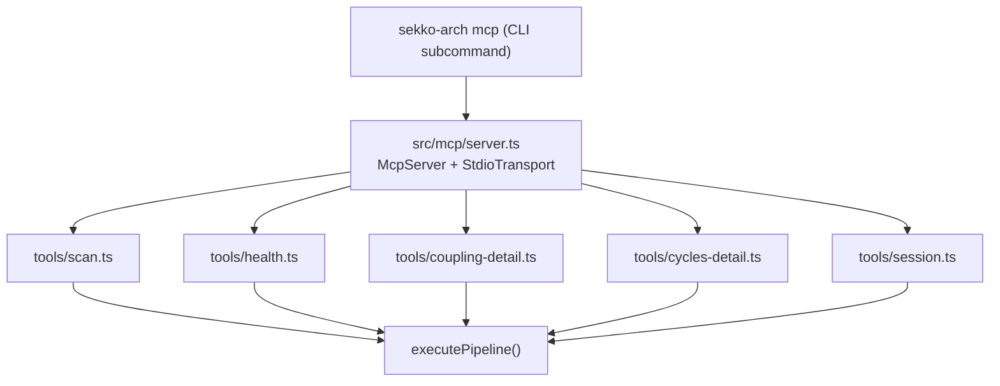
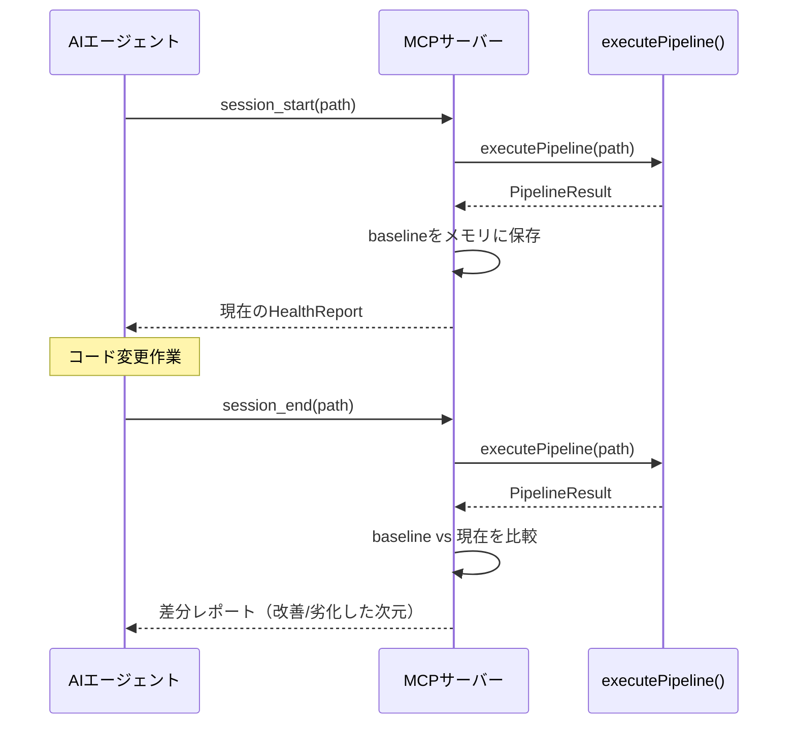
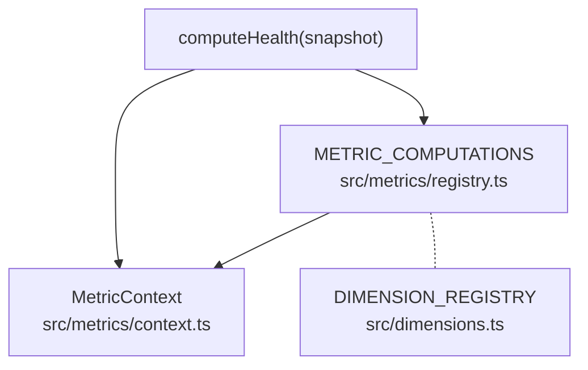
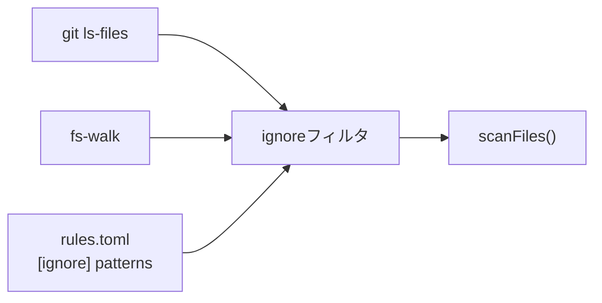

# Design Doc: sekko-arch Milestone 2 — MCP連携 + ファイルレベル指標拡充

## 1. 概要

sekko-archのMilestone 2として、stdio MCPサーバーによるAIエージェント連携と、12の新メトリクス（計19指標）によるアーキテクチャ品質計測の拡充を実装する。MCPサーバーは`executePipeline()`を直接呼び出し、セッション管理によりエージェントがコード変更前後のスコア比較を自律的に実行可能にする。npmパッケージとして公開済みのため、`npx sekko-arch mcp`で即座にMCPサーバーを起動可能。型システム・パーサー・採点システムの拡張により、認知的複雑度・重複検出・デッドコード検出など、ファイル・関数レベルの品質指標を網羅する。

## 2. 背景と動機

### 2.1 M1の達成状況とM2の必要性

M1ではCLIベースの7メトリクス計測パイプラインを構築し、scan/check/gateコマンドによるワークフローを確立した。しかし、M1のワークフローには2つの制約がある。

第一に、AIエージェントがsekko-archを利用するにはCLIの実行・出力解析を手動で行う必要があり、エージェントの自律的な品質フィードバックループを実現できない。MCPサーバーとして公開することで、Claude Code等のエージェントが構造品質を意識した開発を自律的に行えるようになる。

第二に、M1の7メトリクスはモジュール構造・アーキテクチャレベルが中心で、ファイル・関数レベルの品質指標が不足している。認知的複雑度、重複コード、デッドコードなど、日常的なコード品質の問題を検出するには、より粒度の細かい指標が必要である。

M1のCLIワークフロー（scan → gate --save → 作業 → gate）をMCPのsession_start/session_endに対応させることで、CLIとMCPの両方から同一のパイプラインを利用する一貫したアーキテクチャを維持する。

### 2.2 制約条件

M1で確立された以下の設計原則を維持する。

- **パイプラインアーキテクチャ**: 6フェーズの線形パイプライン（File Collection → Line Counting → Parsing → Graph → Metrics → Output）
- **不変Snapshot設計**: 全ての中間結果は不変で、フェーズ間の結合を最小化
- **メトリクスレジストリ + MetricContext**: M1リファクタリングで導入済み。各メトリクスは`src/metrics/{name}.ts`に独立実装し、`src/metrics/registry.ts`の`METRIC_COMPUTATIONS`に登録。共有データは`src/metrics/context.ts`の`MetricContext`に集約
- **DimensionConfig一元管理**: `src/dimensions.ts`の`DIMENSION_REGISTRY`が閾値・ラベル・整数フラグの単一情報源。新メトリクス追加は2ファイル変更で完結
- **stdioトランスポート制約**: MCPサーバーはstdio transportを使用し、stdout出力は一切禁止（JSON-RPCプロトコルを破壊するため）
- **executePipeline()の直接利用**: MCP・CLI間でパイプラインコードを共有し、重複を排除

## 3. ゴールと成功基準

| 基準 | 計測方法 |
|------|---------|
| AIエージェントがMCP設定でsekko-archを利用可能 | Claude Codeでscan → session_start → 作業 → session_endワークフローを実行 |
| 12の新メトリクスが既存パイプラインで計算される | 19次元全てにA-Fグレードが付与されることを検証 |
| M1のCLI機能が19次元に対応 | scan/check/gateが19次元で動作し、後方互換性を維持 |
| 認知的複雑度がSonarSource仕様に準拠 | SonarSource仕様のテストケースで検証 |
| セッション管理でスコア比較が可能 | session_start → コード変更 → session_endで差分が正しく報告される |
| 既存テストが19次元に対応 | 全既存テストが更新・パスする |

## 4. 提案

### 4.1 MCPサーバーアーキテクチャ

#### なぜMCPか

AIエージェントがsekko-archを利用する方法として、(1) CLI実行+出力パース、(2) HTTP APIサーバー、(3) MCPサーバーの3つが考えられる。CLI実行は出力フォーマットの変更に脆弱で、エージェントのツールチェーンに自然に統合されない。HTTP APIは常駐プロセスの管理が必要になる。MCPはClaude Code等のAIエージェントが標準的に利用するプロトコルであり、stdio transportにより常駐プロセス管理も不要である。

#### モジュール構造

MCPサーバーをモジュラー構造で実装する。



`src/mcp/server.ts`がMcpServerインスタンスとStdioServerTransportの初期化を担当し、各ツールハンドラは`src/mcp/tools/*.ts`に分離する。この構造は既存コードベースの1ファイル1関心事規約に合致し、個別ツールハンドラの独立テストを可能にする。

#### ツール設計

ハイブリッド粒度（5-6ツール + フィルタパラメータ）を採用する。

| ツール | 目的 | 主要パラメータ |
|-------|------|--------------|
| `scan` | フルパイプライン実行、19次元の結果返却 | `path: string`, `dimensions?: string[]`（フィルタ） |
| `health` | ヘルスレポートのみ返却（ファイル詳細なし） | `path: string` |
| `coupling_detail` | カップリング問題の詳細診断 | `path: string` |
| `cycles_detail` | 循環依存の詳細診断 | `path: string` |
| `session_start` | ベースラインスナップショットをメモリに保存 | `path: string` |
| `session_end` | 現在の状態とベースラインを比較、差分を返却 | `path: string` |

この粒度を選択した理由は3つある。(1) 多数の小粒度ツール（15+）はAIエージェントのツール選択を複雑にする。(2) ほとんどのメトリクスがフルパイプライン実行を必要とするため、個別メトリクスツールの粒度メリットが薄い。(3) フィルタパラメータにより、必要な次元だけを取得する柔軟性を確保できる。

#### CLIからの起動と配布

`sekko-arch mcp`サブコマンドとして起動する。既存のscan/check/gateと同じcommander構造に追加する。`runMcpServer()`は`executePipeline()`を直接importし、CLIのフォーマッタやprocess.exit()を経由しない。

npmパッケージ`sekko-arch`として公開済みのため、Claude Code等のMCP設定は以下で完結する:

```json
{ "command": "npx", "args": ["sekko-arch", "mcp"] }
```

ユーザーはclone・buildなしで即座にMCPサーバーを利用可能。tree-sitterとoxc-resolverのネイティブ依存は各パッケージが自身のprebuildバイナリを配布しているため、sekko-arch側での対応は不要。

### 4.2 セッション管理

#### なぜインメモリか

セッション状態はプロセス内メモリ（モジュールレベル変数）で管理する。stdio MCPは1プロセス=1接続のライフサイクルであり、セッション状態は自然にプロセスにスコープされる。ファイルシステム書き込み方式はI/Oとクリーンアップの負担が生じ、クライアント提供方式はペイロードサイズの問題がある。

#### ワークフロー



`session_start`はパイプラインを実行してHealthReportをモジュールレベル変数に保存し、現在のスコアをエージェントに返却する。`session_end`はパイプラインを再実行し、保存されたベースラインとの差分を計算して返却する。プロセス終了時にセッション状態は自然に破棄される。

**エッジケースの処理**: `session_start`が二重に呼ばれた場合は、前回のベースラインを上書きし最新のスナップショットで更新する。`session_end`がベースラインなしで呼ばれた場合は、エラーメッセージを返却しフルスキャン結果のみを提示する（差分なし）。

### 4.3 12の新メトリクス

#### 4.3.1 カテゴリ1追加: モジュール構造

**Cohesion（モジュール凝集度）**

モジュール内ファイル間の接続度を計測する。各モジュール（depth-2ディレクトリ）について、モジュール内エッジ数を(N-1)（最小全域木のエッジ数）で割った比率を計算する。Nはモジュール内のファイル数。全モジュールの最低値を報告する。

- アルゴリズム: `cohesion = intra-module edges / (N - 1)` （N >= 2のモジュールのみ）
- データソース: `importGraph.edges` + `moduleAssignments`（既存データ、グラフ層変更不要）
- 採点方向: 高凝集度が良（逆方向採点）。rawValueを`1 - cohesion`に反転してgradeDimension()に渡す

| A | B | C | D | F |
|---|---|---|---|---|
| >= 0.70 | >= 0.50 | >= 0.30 | >= 0.10 | < 0.10 |

**Entropy（依存エントロピー）**

依存エッジ分布のShannon情報量を正規化して計測する。低エントロピーは依存が特定のモジュールに集中（良い設計）、高エントロピーは依存が散漫に分散（悪い設計）を示す。

- アルゴリズム: `H = -Σ(p_i * log2(p_i))`、正規化: `H_norm = H / log2(N)` （Nはモジュール数）で[0,1]範囲にする
- データソース: `importGraph.edges` + `moduleAssignments`（既存データ、グラフ層変更不要）
- 採点方向: 高エントロピーが悪（標準方向）

| A | B | C | D | F |
|---|---|---|---|---|
| <= 0.40 | <= 0.55 | <= 0.70 | <= 0.90 | > 0.90 |

#### 4.3.2 カテゴリ2追加: ファイル・関数レベル（8メトリクス）

**Cognitive Complexity（認知的複雑度）**

SonarSource仕様に基づく認知的複雑度>15の関数比率。循環的複雑度（McCabe）がテスト工数の予測に有効なのに対し、認知的複雑度は人間の理解しにくさを計測する。

- アルゴリズム: 3ルール — (1) 制御フローブレーク（if/for/while/catch）で+1、(2) ネストレベルに応じて+N加算、(3) ブーリアン演算子のシーケンス変化（&&→||等）で+1
- パーサー拡張: `src/parser/cognitive-complexity.ts`に新規実装。既存の`enrichWithComplexity`と同じノード検索インフラを再利用
- FuncInfo拡張: `cognitiveComplexity: number`を必須フィールドとして追加

| A | B | C | D | F |
|---|---|---|---|---|
| <= 0.02 | <= 0.05 | <= 0.10 | <= 0.20 | > 0.20 |

**Hotspots（ホットスポット）**

高fan-in（多くのファイルから依存されている）かつ高instability（自身も多くの依存を持つ）なファイル。変更時のリスクが高い箇所を特定する。

- アルゴリズム: 各ファイルについて`score = fan-in * instability`の複合スコアを計算。`score >= 5.0`のファイルをホットスポットとして分類し、その比率を報告。閾値5.0はfan-in=10, I=0.5（中程度の不安定度で10ファイルから依存される）に相当
- データソース: `fanMaps`（既存データ）

| A | B | C | D | F |
|---|---|---|---|---|
| 0 | <= 0.01 | <= 0.03 | <= 0.05 | > 0.05 |

**Long Functions（長関数）**

50行超の関数比率。長い関数は理解・テスト・保守が困難であり、単一責任原則の違反を示唆する。

- アルゴリズム: `ratio = count(fn.lineCount > 50) / totalFunctions`
- データソース: `FileNode.sa.functions[].lineCount`（既存データ、追加抽出不要）

| A | B | C | D | F |
|---|---|---|---|---|
| <= 0.05 | <= 0.10 | <= 0.15 | <= 0.25 | > 0.25 |

**Large Files（大ファイル）**

500行超のファイル比率。大きなファイルは複数の関心事が混在している可能性が高く、モジュール分割の候補となる。

- アルゴリズム: `ratio = count(file.lines > 500) / totalFiles`
- データソース: `FileNode.lines`（既存データ、追加抽出不要）

| A | B | C | D | F |
|---|---|---|---|---|
| <= 0.05 | <= 0.10 | <= 0.15 | <= 0.25 | > 0.25 |

**High Params（多引数関数）**

引数>4の関数比率。引数が多い関数はインターフェースが複雑であり、オブジェクトパラメータへのリファクタリング候補となる。

- アルゴリズム: `ratio = count(fn.paramCount > 4) / totalFunctions`
- データソース: `FileNode.sa.functions[].paramCount`（既存データ、追加抽出不要）

| A | B | C | D | F |
|---|---|---|---|---|
| <= 0.03 | <= 0.05 | <= 0.08 | <= 0.15 | > 0.15 |

**Duplication（コード重複）**

正規化ボディハッシュによる関数の重複比率。完全に同一の関数本体（空白・コメントを正規化後）を持つ関数を検出する。

- アルゴリズム: 各関数のbodyHashをグループ化し、2つ以上の関数が同じハッシュを持つグループの関数比率を報告
- パーサー拡張: `function-extractors.ts`の`makeFuncInfo`内でASTノードの`.text`プロパティから正規化ハッシュを計算
- FuncInfo拡張: `bodyHash: string`を必須フィールドとして追加
- 正規化手順: コメントノードを除外 → 空白を正規化 → ハッシュ計算。メモリ効率のためハッシュのみ保持

| A | B | C | D | F |
|---|---|---|---|---|
| <= 0.01 | <= 0.03 | <= 0.05 | <= 0.10 | > 0.10 |

**Dead Code（デッドコード）**

未参照エクスポート関数の比率。ファイルレベル検出として、`reverseAdjacency`で入次数0かつエントリポイントでないファイルのエクスポート関数を報告する。

- アルゴリズム: reverseAdjacencyで入次数0のファイルを特定 → エントリポイントを除外 → 対象ファイル内のエクスポート関数比率を計算
- データソース: `importGraph.reverseAdjacency` + `entryPoints`（既存データ）
- M2スコープ: ファイルレベル検出。シンボルレベル検出（named import追跡）はM3候補

| A | B | C | D | F |
|---|---|---|---|---|
| <= 0.03 | <= 0.05 | <= 0.08 | <= 0.15 | > 0.15 |

**Comments（コメント比率）**

コメント行比率。コメントが少なすぎるコードベースは保守性が低い。逆方向採点（高コメント率が良）を適用する。

- アルゴリズム: `ratio = totalCommentLines / totalLines`
- データソース: `FileNode.comments` / `FileNode.lines`（既存データ、追加抽出不要）
- 採点方向: 高コメント率が良（逆方向採点）。rawValueを`1 - ratio`に反転してgradeDimension()に渡す

| A | B | C | D | F |
|---|---|---|---|---|
| >= 0.08 | >= 0.05 | >= 0.03 | >= 0.01 | < 0.01 |

#### 4.3.3 カテゴリ3追加: アーキテクチャレベル

**Distance from Main Sequence（メインシーケンスからの距離）**

Robert C. Martinの理想線（A + I = 1）からのモジュール距離を計測する。抽象度（A）が高いモジュールは不安定であるべきで、具象的なモジュールは安定であるべきという原則に基づく。

- アルゴリズム: 各モジュールについて `D = |A + I - 1|` を計算。A = (interface数 + type-alias数) / 総クラス数、I = fan-out / (fan-in + fan-out)。全モジュールの最大Dを報告。ClassInfoが0のモジュール（関数のみで構成）はA=0として計算する（完全に具象的とみなす）
- データソース: `ClassInfo.kind`（abstractness算出）+ `fanMaps`（instability算出）

| A | B | C | D | F |
|---|---|---|---|---|
| <= 0.20 | <= 0.35 | <= 0.50 | <= 0.70 | > 0.70 |

**Attack Surface（攻撃面）**

エントリポイントから到達可能なファイル比率。攻撃面が広いほど、セキュリティ脆弱性の影響範囲が大きくなる。

- アルゴリズム: エントリポイント（index.ts、main.ts等）から`importGraph.adjacency`をBFS探索し、到達可能ファイル数 / 総ファイル数を計算
- データソース: `importGraph.adjacency` + `entryPoints`（既存データ）

| A | B | C | D | F |
|---|---|---|---|---|
| <= 0.30 | <= 0.45 | <= 0.60 | <= 0.80 | > 0.80 |

### 4.4 パイプライン拡張

#### MetricContext + レジストリパターン（M1リファクタリングで導入済み）

M1完了後のリファクタリングで、メトリクス計算の基盤が以下のように整備された。この基盤の上にM2の12新メトリクスを追加する。



**MetricContext**（`src/metrics/context.ts`）: 共有の不変データを集約するデータオブジェクト。`fanMaps`、`moduleAssignments`、`entryPoints`、`foundationFiles`、`allFunctions`、`cycleResult`を保持する。全フィールドは不変（readonly）であり、計算ロジックを含まない。M2では`moduleEdges`（モジュール間エッジ集計）を追加する。

**METRIC_COMPUTATIONS**（`src/metrics/registry.ts`）: 各メトリクスの計算関数を`MetricComputation`インターフェースで統一し、配列として登録。`computeHealth()`はこの配列をイテレーションするだけの33行のオーケストレータとなっている。M2では12の新エントリを追加する。

**DIMENSION_REGISTRY**（`src/dimensions.ts`）: 閾値・ラベル・整数フラグの単一情報源。新メトリクス追加は(1) `DIMENSION_REGISTRY`にエントリ追加、(2) `METRIC_COMPUTATIONS`にcompute関数追加の2ファイル変更で完結する。

#### 新メトリクスファイル

12の新メトリクスは既存規約に従い、各`src/metrics/{name}.ts`ファイルに実装する。各ファイルは`compute*()` または `detect*()`関数をエクスポートし、MetricContextを受け取って計算結果を返す。

### 4.5 型システム拡張

#### DimensionName union型

7メンバーから19メンバーに拡張する。全次元は設計時に既知であり、コンパイル時安全性を優先する。

#### DimensionGradesインターフェース

12の新フィールドを全て**必須**として追加する。optionalフィールドにするとcomputeCompositeGrade()でundefined判定が必要になり複雑化する。M2はメジャーバージョン内の開発であり、breaking changeが許容される。

この変更により、フォーマッタ・CLI check/gate・全テストの同時更新が必要になる。`DIMENSION_REGISTRY`への新エントリ追加により、閾値・ラベル・フォーマット設定が自動的に全コンポーネントに反映される。

#### FuncInfo拡張

2つの必須フィールドを追加する。

- `bodyHash: string` — 正規化テキストのハッシュ。パース時に計算しハッシュのみ保持（メモリ効率）
- `cognitiveComplexity: number` — SonarSource認知的複雑度。既存CCと同一パスで計算

両フィールドはパースが成功すれば常に計算可能であるため、optionalにする理由がない。

### 4.6 パーサー拡張

#### 4.6.1 認知的複雑度

`src/parser/cognitive-complexity.ts`に新アルゴリズムを実装する。既存の`enrichWithComplexity`と同じノード検索インフラ（`findFunctionNode()`）を再利用し、二重走査を回避する。

SonarSource仕様の3ルール:

1. **制御フローブレーク**: if / for / while / catch で+1。else、switch caseはインクリメントしない
2. **ネストレベル加算**: ネストされた制御構造ごとに+N（Nは現在のネスト深度）
3. **ブーリアン演算子シーケンス変化**: `&&`から`||`（またはその逆）への変化で+1。同一演算子の連続はインクリメントしない

既存の循環的複雑度と認知的複雑度を単一パスで計算することで、ASTの二重走査を回避する。

#### 4.6.2 ボディハッシュ

`function-extractors.ts`の`makeFuncInfo`内でASTノードの`.text`プロパティから正規化ハッシュを計算する。M1リファクタリングで`extractors.ts`は`function-extractors.ts`・`class-extractors.ts`・`import-extractors.ts`に分割済み。

正規化手順:
1. AST子ノードを走査し、`comment` / `line_comment` / `block_comment`型のノードを除外
2. 残りのテキストを連結し、空白を正規化（連続空白を単一スペースに）
3. ハッシュを計算し、`bodyHash`フィールドとして格納

**アロー関数の注意点**: `extractArrowFromDeclarator`では`parentNode`（`lexical_declaration`）を行範囲に使用するが、ボディハッシュには内側の`arrow_function`ノードの`.text`を使用する。`lexical_declaration`には変数宣言構文が含まれるため、関数本体の比較には不適切である。

### 4.7 採点システム拡張

#### 4.7.1 逆方向採点の導入

Comments（高コメント率=良）とCohesion（高凝集度=良）は、既存の「低いrawValue=良いグレード」という前提と逆方向の採点が必要になる。

rawValueを反転（`1 - ratio`）してからgradeDimension()に渡す方式を採用する。gradeDimension()自体の変更は不要で、影響範囲が最小になる。DimensionResultの`details`フィールドに元の非反転値を保持し、表示時の直感性を維持する。

gradeDimension()に方向フラグを追加する方式も検討したが、既存7メトリクスの呼び出しも全て変更が必要になり、影響範囲が大きい。反転方式は既存コードへの変更がゼロである。

#### 4.7.2 複合グレードの動的化

M1リファクタリングで`computeCompositeGrade()`はDimensionGradesの動的イテレーションに切り替え済み。ハードコードされた7次元リストは解消されており、M2で次元を追加しても複合グレード計算の変更は不要。採点式（`min(floor(mean), worst + 1)`）は19次元全てに均等適用する。

重み付け方式（カテゴリ別重み等）は検討したが、恣意性を排除し結果の予測可能性を保つため、均等適用を維持する。次元数の増加により個別次元の平均への影響は薄まるが、worst+1キャップにより深刻な問題は必ず複合スコアに表出する。

#### 4.7.3 閾値テーブル

`src/dimensions.ts`の`DIMENSION_REGISTRY`に12の新エントリを追加する。閾値はDimensionConfigの`thresholds`フィールドに定義され、`gradeDimension()`が`DIMENSION_REGISTRY`を参照して採点する。

12の新メトリクス閾値一覧（再掲、統合表）:

| メトリクス | 方向 | A | B | C | D | F |
|-----------|------|---|---|---|---|---|
| Cohesion | 逆方向（高=良） | >= 0.70 | >= 0.50 | >= 0.30 | >= 0.10 | < 0.10 |
| Entropy | 標準（低=良） | <= 0.40 | <= 0.55 | <= 0.70 | <= 0.90 | > 0.90 |
| Cognitive Complexity | 標準（低=良） | <= 0.02 | <= 0.05 | <= 0.10 | <= 0.20 | > 0.20 |
| Hotspots | 標準（低=良） | 0 | <= 0.01 | <= 0.03 | <= 0.05 | > 0.05 |
| Long Functions | 標準（低=良） | <= 0.05 | <= 0.10 | <= 0.15 | <= 0.25 | > 0.25 |
| Large Files | 標準（低=良） | <= 0.05 | <= 0.10 | <= 0.15 | <= 0.25 | > 0.25 |
| High Params | 標準（低=良） | <= 0.03 | <= 0.05 | <= 0.08 | <= 0.15 | > 0.15 |
| Duplication | 標準（低=良） | <= 0.01 | <= 0.03 | <= 0.05 | <= 0.10 | > 0.10 |
| Dead Code | 標準（低=良） | <= 0.03 | <= 0.05 | <= 0.08 | <= 0.15 | > 0.15 |
| Comments | 逆方向（高=良） | >= 0.08 | >= 0.05 | >= 0.03 | >= 0.01 | < 0.01 |
| Distance from Main Seq | 標準（低=良） | <= 0.20 | <= 0.35 | <= 0.50 | <= 0.70 | > 0.70 |
| Attack Surface | 標準（低=良） | <= 0.30 | <= 0.45 | <= 0.60 | <= 0.80 | > 0.80 |

### 4.8 `rules.toml [ignore]`によるスキャン対象フィルタリング

#### なぜ必要か

現在のスキャナーは`git ls-files`（またはファイルシステムウォーク）で全TypeScriptファイルを収集し、`node_modules`・`dist`・`.git`のみハードコードで除外している。しかし実プロジェクトでは、生成コード（Protocol Buffers、GraphQL codegen等）、ベンダリングされたライブラリ、テスト用フィクスチャ、レガシーコードなど、解析対象に含めたくないディレクトリ・ファイルが存在する。これらがメトリクスに含まれると、プロジェクト固有のノイズがスコアを歪め、ツールの信頼性が低下する。

#### なぜ `rules.toml` に統合するか

除外設定を独立ファイル（`.sekkoignore`等）にする案も検討したが、`.sekko-arch/`ディレクトリが既に設定・状態管理の場所として確立されており（`rules.toml`でルール定義、`baseline.json`でゲート状態管理）、除外設定もここに統合するのが自然である。`rules.toml`はプロジェクトのアーキテクチャルールを定義するファイルであり、「どのファイルを解析対象にするか」もルールの一部として位置づけられる。独立ファイルはプロジェクトルートの肥大化を招き、ツール固有の設定ファイルが散らばる原因になる。

#### 仕様

`.sekko-arch/rules.toml`に`[ignore]`セクションを追加し、`patterns`配列でglobパターンを定義する。

```toml
[constraints]
max_cycles = 0
max_coupling = 0.30

[ignore]
patterns = [
  "src/generated/",
  "**/*.generated.ts",
  "vendor/",
  "legacy/",
]
```

**`patterns`のセマンティクス**:
- 各エントリはglobパターン（`*`、`**`対応）
- `/`で終わるパターンはディレクトリ配下を再帰的にマッチ
- パターンはプロジェクトルートからの相対パスに対してマッチ
- 配列が空または`[ignore]`セクション自体がない場合: デフォルト除外のみ適用

**実装方針**:

`picomatch` npmパッケージ（軽量なglobマッチングライブラリ、micromatchのコア）を使用してパターンマッチングを行う。`rules.toml`のパースは既存の`parseRulesFile()`を拡張し、`IgnoreConfig`を`RulesConfig`に追加する。



**統合ポイント**: `src/scanner/index.ts`の`scanFiles()`内で、`gitListFiles()`または`fsWalkFiles()`が返すパス一覧に対して`[ignore]`パターンをフィルタリングする。既存の除外ロジック（`EXCLUDED_DIRS`、テストファイル除外）は維持し、`[ignore]`は追加のフィルタレイヤーとして適用する。パターンの読み込みは`parseRulesFile()`経由で行い、スキャナーがTOMLパースを直接行わない。

**エッジケースの処理**:
- `rules.toml`が存在しない場合: デフォルト除外のみ適用（エラーなし）
- `[ignore]`セクションがない場合: デフォルト除外のみ適用
- `patterns`が空配列の場合: デフォルト除外のみ適用
- 不正なglobパターン: `picomatch`のエラーハンドリングに委ねる

### 4.9 `--include`オプションによるディレクトリ絞り込み

#### なぜ必要か

`.sekkoignore`は「除外したいもの」を指定する減算的アプローチだが、逆に「調査したいディレクトリだけ」を指定する加算的アプローチも実用上重要である。モノレポで特定パッケージだけ調査したい、巨大プロジェクトの一部モジュールのアーキテクチャだけ確認したい、といったユースケースに対応する。

#### 仕様

CLI全コマンド（scan, check, gate）に`--include <dir>`オプションを追加する。複数指定可（Commander.jsの`option('--include <dirs...>')`）。

```bash
# src/api と src/models 配下のみスキャン
sekko-arch scan . --include src/api --include src/models

# check/gateでも同様に使用可能
sekko-arch check . --include src/core
sekko-arch gate . --include src/api --save
```

**セマンティクス**:
- `--include`が指定されない場合: 従来通り全ファイルをスキャン（`[ignore]`パターンによる除外は適用）
- `--include`が指定された場合: 指定ディレクトリのプレフィックスにマッチするファイルのみスキャン対象。その上で`[ignore]`パターンによる除外も適用
- 適用順序: ファイル収集 → `--include`フィルタ → `[ignore]`フィルタ → スキャン
- 指定パスはプロジェクトルートからの相対パス。末尾の`/`はあってもなくても同じ動作

**実装方針**:

`scanFiles()`のシグネチャにオプションオブジェクトを追加する。

```typescript
export interface ScanOptions {
  readonly include?: readonly string[];  // --include で指定されたディレクトリ
}

export function scanFiles(rootDir: string, options?: ScanOptions): FileNode[]
```

フィルタロジックは単純なプレフィックスマッチ:

```typescript
function matchesInclude(relPath: string, includes: readonly string[]): boolean {
  return includes.some(dir => relPath.startsWith(dir));
}
```

**MCPツールへの適用**: MCPのscanツールにも`include`パラメータを追加し、エージェントが特定ディレクトリのみのスキャンを実行可能にする。

**`--include`と`[ignore]`の関係**: `--include`は「対象を絞る」、`[ignore]`は「対象から除外する」であり、両方が指定された場合は`--include`で絞った後に`[ignore]`で除外する。つまり`--include`で指定したディレクトリ内でも`[ignore]`のパターンにマッチするファイルは除外される。

### 4.10 問題箇所の詳細出力（M1未達要件の解消）

#### 背景

FeatureSpecのUser Stories（調査時ワークフロー）に「問題箇所（循環依存、god file等）を特定」、成功基準に「劣化した次元と対象ファイルを表示」と明記されているが、M1の実装では未達となっている。

**現状の問題**:
- 各メトリクスは`DimensionResult.details`に問題箇所データを保持している（cycles, deepestPath, violations等）
- しかしtableフォーマッタはスコアとグレードのみ表示し、detailsを一切使用していない
- JSONフォーマッタは`rawValue`と`grade`のみ出力し、`details`を明示的に捨てている
- 一部メトリクス（complexFn, blastRadius）は問題の**数**のみ保持し、**どのファイル・関数が該当するか**を`details`に含めていない

#### 4.8.1 detailsデータの充実

M1で不足しているdetailsデータを補完する。

| 次元 | 現状のdetails | 追加すべきデータ |
|------|--------------|-----------------|
| cycles | `cycles: string[][]` ✅ | — |
| coupling | `crossModuleEdges`, `crossModuleToUnstable` ✅ | — |
| depth | `deepestPath: string[]` ✅ | — |
| godFiles | `files: string[]`, `count` ✅ | — |
| complexFn | `totalFunctions`, `complexCount` のみ | **問題関数リスト**: `complexFunctions: Array<{file, name, cc}>` |
| levelization | `violations`, `totalEdges` ✅ | — |
| blastRadius | `maxBlastRadius`, `totalFiles` のみ | **最大影響ファイル名**: `maxBlastRadiusFile: string` |

M2新メトリクスについては、各メトリクスの実装時（Group C/D）に適切なdetailsを設計する。原則として、グレードがC以下になった場合にユーザーが「何を直せばいいか」を特定できる情報を含める。

#### 4.8.2 JSONフォーマッタのdetails出力

`formatJson()`の出力に`details`フィールドを含める。

```typescript
// Before (M1)
dimensions[config.name] = { rawValue: dim.rawValue, grade: dim.grade };

// After
dimensions[config.name] = {
  rawValue: dim.rawValue,
  grade: dim.grade,
  details: dim.details ?? {},
};
```

これはAIエージェント（MCP経由）やCI連携（`--format json`）で問題箇所を機械的に特定するための基盤となる。

#### 4.8.3 tableフォーマッタの問題箇所表示

tableフォーマッタのスコア表の後に、グレードC以下の次元について問題箇所サマリーを追加表示する。

```
  sekko-arch — Architecture Health Report

  Dimension            Value  Grade
  ─────────────────────────────────
  Cycles                   2      C
  Coupling              0.15      A
  ...
  ─────────────────────────────────
  Composite                       B

  ⚠ Issues detected:

  Cycles (C):
    src/a.ts → src/b.ts → src/a.ts
    src/x.ts → src/y.ts → src/z.ts → src/x.ts

  Complex Functions (D):
    src/parser/extractors.ts: extractImports (CC=23)
    src/metrics/coupling.ts: computeCoupling (CC=18)

  32 files scanned in 145ms
```

表示ルール:
- グレードA/Bの次元はサマリーに表示しない（問題なし）
- 各次元で表示する件数は最大5件（それ以上は `...and N more` で省略）
- 次元ごとにdetailsの構造に応じたフォーマッタ関数を用意する

## 5. 設計決定

### MCPツール粒度: ハイブリッド（5-6ツール + フィルタ）

| 決定 | ハイブリッド粒度（5-6ツール + dimensionsフィルタパラメータ） |
|------|----------------------------------------------------------|
| 理由 | 多数の小粒度ツール（15+）はAIエージェントのツール選択を複雑にし、ほとんどのメトリクスがフルパイプライン実行を必要とするため粒度のメリットが薄い。少数の粗粒度ツール（3）では診断的ドリルダウンができない。フィルタパラメータ付きの5-6ツールが最適なバランスを提供する |
| 再検討条件 | M3でツール数が10を超える場合、カテゴリ別のツール統合を検討 |

### セッション状態: インメモリ（モジュールレベル変数）

| 決定 | プロセス内メモリ（モジュールレベル変数）でセッション状態を管理 |
|------|----------------------------------------------------------|
| 理由 | stdio MCPは1プロセス=1接続のライフサイクルであり、セッション状態は自然にプロセスにスコープされる。ファイルシステム書き込みは不要なI/Oとクリーンアップの負担を生む。クライアント提供方式はペイロードサイズの問題がある |
| 再検討条件 | SSE/WebSocketトランスポートで複数クライアント対応が必要になった場合 |

### MCPモジュール構造: モジュラー（server.ts + tools/*.ts）

| 決定 | `src/mcp/server.ts` + `src/mcp/tools/*.ts`のモジュラー構造 |
|------|----------------------------------------------------------|
| 理由 | 既存コードベースの1ファイル1関心事規約に合致する。個別ツールハンドラの独立テストが可能。モノリシック構造はツール増加に伴い肥大化する |
| 再検討条件 | なし（既存規約に従う明確な選択） |

### メトリクス統合: レジストリパターン + MetricContext（M1リファクタリングで導入済み）

| 決定 | `METRIC_COMPUTATIONS`レジストリ + `MetricContext`による共有データ集約。`computeHealth()`は33行のオーケストレータ |
|------|-----------------------------------------------------------------------------------------------------|
| 理由 | M1リファクタリングで7メトリクス時点の`computeHealth()`（167行/11 import）を分解。レジストリパターンにより新メトリクス追加が`METRIC_COMPUTATIONS`への1エントリ追加で完結する。MetricContextが共有データ（fanMaps、moduleAssignments等）のパラメータ爆発を解消。当初は過剰設計と判断したが、M2で19メトリクスに拡張する前提ではこの規模が妥当 |
| 再検討条件 | MetricContextのフィールド数が10を超え「神オブジェクト」化する兆候が出た場合、カテゴリ別のサブコンテキスト分割を検討 |

### Dead Code検出: ファイルレベル（入次数0ファイルのエクスポート関数）

| 決定 | ファイルレベル検出（reverseAdjacencyで入次数0 + エントリポイント除外） |
|------|----------------------------------------------------------------|
| 理由 | シンボルレベル検出はImportInfo拡張（named import追跡）が必要で、パーサーとグラフ層の両方に非自明な変更が必要。ファイルレベルでも有意なシグナル（完全に未参照のファイル内のエクスポート関数）が得られる |
| 再検討条件 | ファイルレベルの検出精度が不十分で、false positive率が高い場合。M3候補としてシンボルレベルに拡張 |

### Duplication検出: 正規化ボディハッシュ

| 決定 | 正規化テキストハッシュ（コメント除去・空白正規化）をFuncInfoにハッシュのみ保持 |
|------|----------------------------------------------------------------------|
| 理由 | AST構造ハッシュは構造的重複を検出できるが複雑度が高い。トークンシーケンスハッシュは中間的だが実装コストに見合うメリットが不明確。正規化テキストハッシュは単純・高速で完全重複を確実に検出。ハッシュのみ保持でメモリ効率を維持 |
| 再検討条件 | 正規化テキストハッシュでは検出できない構造的重複がユーザーから報告された場合 |

### 逆方向採点: rawValue反転方式

| 決定 | メトリクス計算時にrawValueを反転（`1 - ratio`）してからgradeDimension()に渡す |
|------|-------------------------------------------------------------------------|
| 理由 | gradeDimension()に方向フラグを追加する方式と比較して、rawValue反転はグレーディング関数の変更が不要で影響範囲が最小。detailsフィールドで元の値を保持できるため表示上の直感性も維持 |
| 再検討条件 | 逆方向採点のメトリクスがM3で3つ以上に増加し、反転の管理が煩雑になった場合 |

### DimensionGrades拡張: 全フィールド必須（breaking change）

| 決定 | 12の新フィールドを全て必須（optional不使用）として追加 |
|------|--------------------------------------------------|
| 理由 | optionalフィールドは複合グレード計算でundefined判定を必要とし複雑化する。M2はメジャーバージョン内の開発でbreaking changeが許容される。19次元は設計時に全て既知でコンパイル時安全性を優先 |
| 再検討条件 | `Record<DimensionName, DimensionResult>`型へのM3移行時 |

### 問題箇所表示: グレードC以下のみ + 最大5件

| 決定 | tableフォーマッタでグレードC以下の次元のみ問題箇所を表示。各次元最大5件、超過分は省略 |
|------|----------------------------------------------------------------------------|
| 理由 | A/Bは許容範囲内であり詳細表示はノイズになる。全件表示はターミナルの可読性を損なう。5件あれば問題の傾向を把握でき、全件が必要な場合はJSON出力を使用する |
| 再検討条件 | ユーザーが `--verbose` フラグで全件表示を要望した場合 |

### 除外設定の配置: `rules.toml [ignore]`セクション

| 決定 | 独立ファイル（`.sekkoignore`等）ではなく、既存の`rules.toml`に`[ignore]`セクションとして統合 |
|------|----------------------------------------------------------------------------|
| 理由 | `.sekko-arch/`ディレクトリが設定・状態管理の場所として確立済み（`rules.toml` + `baseline.json`）。除外設定もルールの一部として同じファイルに統合することで、設定の散逸を防ぎ、`parseRulesFile()`の既存パースインフラを再利用できる |
| 再検討条件 | 除外パターンが複雑化し（否定パターン等）、TOML配列では表現力が不足する場合 |

### globマッチング: `picomatch`パッケージ利用

| 決定 | `picomatch` npmパッケージを使用してglobパターンマッチング |
|------|------------------------------------------------------|
| 理由 | 軽量（micromatchのコア）、ESM対応済み、globマッチングのデファクトスタンダード。`rules.toml`のTOML配列で定義されたパターンは`.gitignore`固有の構文（`!`否定、`#`コメント等）を含まないため、`.gitignore`互換ライブラリ（`ignore`）ではなく純粋なglobマッチャーが適切 |
| 再検討条件 | 否定パターンや`.gitignore`互換の高度な構文が必要になった場合は`ignore`パッケージに切り替え |

### `--include`フィルタ: プレフィックスマッチ

| 決定 | 相対パスの前方一致（`startsWith`）でディレクトリフィルタリング |
|------|----------------------------------------------------------|
| 理由 | glob不要。ディレクトリ指定のユースケースでは前方一致で十分であり、実装が単純で高速。`--include src/api`で`src/api/routes.ts`や`src/api/middleware/auth.ts`等にマッチする |
| 再検討条件 | ファイル単位の細かい指定が求められた場合（ただしその場合は`.sekkoignore`の否定パターンで対応可能） |

### `--include`と`[ignore]`の適用順序

| 決定 | ファイル収集 → `--include`フィルタ → `[ignore]`フィルタの順で適用 |
|------|--------------------------------------------------------------|
| 理由 | `--include`で絞った範囲内でも不要ファイル（生成コード等）は除外したいため、`[ignore]`を後段に配置。逆順だと`--include`で指定したディレクトリ内の除外設定が効かなくなる |
| 再検討条件 | なし（論理的に明確な順序） |

### `[ignore]`適用レイヤー: ファイル収集後フィルタ

| 決定 | `scanFiles()`内でファイル収集後に`[ignore]`パターンをフィルタリング |
|------|----------------------------------------------------------------|
| 理由 | git-filesとfs-walkの両方のパスに統一的にフィルタを適用できる。収集ロジック自体を変更する必要がなく、影響範囲が最小 |
| 再検討条件 | fs-walkで大量のファイルを収集してからフィルタすることがパフォーマンスボトルネックになる場合、fs-walk内での早期除外を検討 |

### npm配布: sekko-archとして公開

| 決定 | npmパッケージ`sekko-arch`として公開。`npx sekko-arch mcp`でMCPサーバー起動 |
|------|------------------------------------------------------------------------|
| 理由 | MCP設定が`npx`一行で完結し、clone・build不要。tree-sitter・oxc-resolverのネイティブ依存は各パッケージのprebuildに任せ、sekko-arch側でのpostinstriptやprebuild対応は不要 |
| 再検討条件 | なし |

### アロー関数ボディハッシュ: 内側ノード使用

| 決定 | ボディハッシュ計算に`arrow_function`ノード（内側ノード）の`.text`を使用 |
|------|------------------------------------------------------------------|
| 理由 | `parentNode`（`lexical_declaration`）には変数宣言構文が含まれ、関数本体の比較に不適切。内側ノードの`.text`は純粋な関数本体のみを含む |
| 再検討条件 | なし（技術的に明確な正解） |

### 複合グレード計算: 19次元均等適用

| 決定 | M1の採点式（`min(floor(mean), worst + 1)`）を19次元全てに均等適用 |
|------|--------------------------------------------------------------|
| 理由 | 既存の採点式は平均による全体品質の反映とworst+1キャップによる深刻問題の表出を両立する。重み付けは恣意性を導入し、結果の予測可能性を損なう |
| 再検討条件 | 19次元の平均が個別次元の問題を過度に希釈する場合、カテゴリ別の中間グレード導入を検討 |

## 6. 検討した代替案

### MCPサーバー構成

**モノリシック単一ファイル**: `src/mcp/server.ts`に全ツールハンドラを配置。実装は単純だが、ツール増加で肥大化しテストが困難になる。1ファイル1関心事の既存規約にも反する。却下。

**CLIの薄いラッパー**: runScan()等のCLI関数をMCPツールから直接呼び出す。コード重複はゼロだが、CLIコマンドが`process.exit()`とstdout書き込みを行うためstdio MCPと非互換。CLIコマンドの大規模リファクタリングが必要になり、M2スコープを超える。却下。

### メトリクス統合パターン

**V1/V2分割（computeHealthV1 + computeHealthV2）**: M1メトリクスとM2メトリクスを別関数で計算。後方互換性は高いが、`fanMaps`や`moduleAssignments`等の共有データの観点で人工的な分離となる。データの二重計算か共有の複雑化を招く。却下。

**インラインオーケストレータ（M1初期設計）**: `computeHealth()`内で各メトリクスを直接呼び出し、`makeDimensionResult`でラップする方式。M1の7メトリクス時点では機能したが、167行/11 importに肥大化し、M2で12メトリクス追加すると管理不能になることが判明。M1リファクタリングでレジストリパターン + MetricContextに移行済み。

### 型システム拡張

**Record<DimensionName, DimensionResult>型への切り替え**: 新次元の追加でインターフェース変更が不要になり、`computeCompositeGrade()`の動的化が自然になる。しかし、名前付きフィールドアクセス（`dimensions.coupling`）とIDEの補完が失われる。19次元はまだ明示的インターフェースで管理可能な規模であるため、M2では現行方式を維持。M3で次元数がさらに増加する場合に再検討。

### 逆方向採点

**方向フラグ追加方式**: `gradeDimension()`に`direction: "normal" | "inverted"`パラメータを追加し、比較ロジックを分岐。機能的には正しいが、既存の7メトリクスの呼び出しも全て`direction: "normal"`を追加する変更が必要になり影響範囲が大きい。却下。

**閾値の降順定義方式**: 閾値を降順に並べ`>=`比較で判定。`gradeDimension()`のcontract（昇順閾値 + `<=`比較）が暗黙的に変わり、保守時のエラーリスクが高い。却下。

### Dead Code検出精度

**シンボルレベル検出**: named importを追跡し、エクスポートされた個別関数の参照有無を判定。精度は高いが、`extractImports()`がnamed import情報を現在追跡しておらず、パーサーとグラフ層の両方に非自明な変更が必要。M2のスコープを超えると判断。M3候補として記録。

## 7. リスクと緩和策

| リスク | 影響 | 緩和策 |
|-------|------|--------|
| 新メトリクスの閾値妥当性 | 過剰なF判定によるツール信頼の低下 | sekko-arch自身を含む実プロジェクトで検証・チューニング。Feature Specの閾値を出発点とし、実データで調整 |
| stdioのstdout出力制約 | パイプライン内のconsole.log使用がJSON-RPCを破壊 | 全ログをstderrに出力。パイプライン内のconsole.log使用箇所を監査し、MCP実行パスでは抑制 |
| 19次元への拡張に伴う既存テストの大規模更新 | DimensionGrades変更のripple effectで多数のテスト修正が必要 | 変更影響範囲を事前に特定し、計画的に管理。型システムのコンパイルエラーをガイドとして使用 |
| bodyHashのアロー関数エッジケース | arrow_function nodeの取得ミスで不正なハッシュ | extractArrowFromDeclarator内で正しいノード参照を単体テストで検証。parentNodeと内側ノードの両方でテストケースを作成 |
| 認知的複雑度のSonarSource仕様準拠 | 仕様の解釈ミスで他ツールと異なるスコアを出力 | SonarSource公式のテストケースで検証。既知のオープンソースプロジェクトでSonarQubeの出力と比較 |
| MCPサーバーの大規模コードベース対応 | 5,000ファイル級のプロジェクトでMCP応答が遅延 | M1のパフォーマンス最適化（worker threads並列化）がMCPからも利用される。session_endの二重パイプライン実行はベースライン保存により1回で済む |
| MetricContextの肥大化 | 共有データの追加でContextが「神オブジェクト」になる | Contextのフィールドは全て不変データであり、ロジックを含まない。データ集約に限定し、計算ロジックは各メトリクスファイルに保持 |
| zod依存の追加 | MCP SDKが`zod`をpeer dependencyとして要求。新たなランタイム依存が増える | zodは広く利用されているバリデーションライブラリであり、セキュリティリスクは低い。MCP SDKの要件であるため回避不可 |
| `picomatch`パッケージのESM互換性 | `picomatch`がESM importに対応していない可能性 | `picomatch` v3+はESM対応済み。npm install後にimport解決を検証 |

## 参考文献

- SonarSource "Cognitive Complexity" specification — 認知的複雑度アルゴリズム
- Shannon (1948) "A Mathematical Theory of Communication" — エントロピー計算
- Robert C. Martin (2003) "Agile Software Development" — Distance from Main Sequence (D=|A+I-1|)
- Constantine & Yourdon (1979) "Structured Design" — 凝集度（Cohesion）
- `picomatch` npm package — 軽量globマッチング (https://www.npmjs.com/package/picomatch)
- M1 Design Doc — パイプラインアーキテクチャ、採点システム、データモデルの基盤設計
