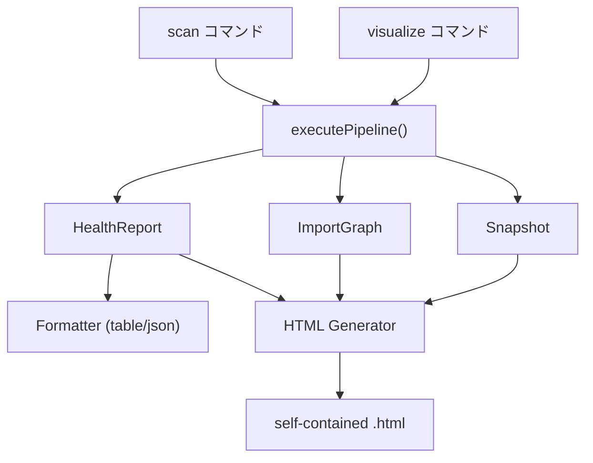

# Design Doc: sekko-arch Milestone 3 — Web可視化 + 進化メトリクス + テスト構造分析

## 1. 概要

sekko-archのMilestone 3として、静的HTML生成によるWeb可視化（Treemap + DSM）、Git履歴に基づく4つの進化メトリクス（Code Churn, Change Coupling, Bus Factor, Code Age）、テストカバレッジギャップ検出、およびカテゴリ別表示を実装する。M2の19メトリクスに5メトリクスを追加し計24指標とする。DSMはメトリクスとしてスコア化せず可視化ツールとして提供する。

## 2. 背景と動機

### 2.1 M2の達成状況とM3の必要性

M2では19メトリクスのA-Fグレーディング、MCPサーバーによるAIエージェント連携、セッション管理によるスコア比較ワークフローを構築した。しかし、M2のアーキテクチャ品質計測には2つの本質的な観点が欠落している。

第一に、**空間認識の回復**が不十分である。M1の動機として「AIエージェントには空間認識がない」と述べたが、M2までのCLI出力（テーブル/JSON）は依然として一次元的な指標の羅列にすぎない。19メトリクスの数値を見ても、ファイル品質の分布や依存構造の全体像を直感的に把握することは困難である。Treemapによるファイル品質の俯瞰とDSMによる依存行列の可視化を組み合わせることで、人間の開発者とAIエージェントの双方がアーキテクチャの空間認識を回復できる。

第二に、**時間軸の欠如**がある。M1/M2の全メトリクスは「現在のコードベースの静的解析」に基づいており、コードベースの進化的な健全性を捉えていない。変更が特定ファイルに集中する傾向（Code Churn）、暗黙的な結合（Change Coupling）、知識の偏在（Bus Factor）、メンテナンスの放置（Code Age）は、いずれも静的解析では計測不可能だが、アーキテクチャの劣化を予測する重要なシグナルである。Git履歴分析により、「現在の構造がどう成り立ったか」という時間軸の品質評価が可能になる。

### 2.2 制約条件

M1/M2で確立した以下の設計原則を維持する。

- **6フェーズパイプライン**: File Collection → Line Counting → Parsing → Graph → Metrics → Output
- **不変Snapshot設計**: 全中間結果は不変で、フェーズ間の結合を最小化
- **MetricContext + レジストリパターン**: 共有データの集約と、`METRIC_COMPUTATIONS`による計算関数の登録
- **DIMENSION_REGISTRY一元管理**: 閾値・ラベル・表示設定の単一情報源
- **stdioトランスポート制約**: MCPサーバーのstdout出力禁止
- **executePipeline()共有**: MCP・CLI間でパイプラインコードを共有

新たなランタイム依存の追加は最小限とし、Git操作は既存のchild_process直接実行パターンに従う。

## 3. ゴールと成功基準

| 基準 | 計測方法 |
|------|---------|
| `visualize`サブコマンドで自己完結型HTMLを生成し、ブラウザで閲覧可能 | Treemap + DSMの2ビューが正常にレンダリングされることを検証 |
| 5つの新メトリクスがA-Fグレードを出力 | 24次元全てにグレードが付与されることを検証 |
| Git不在環境でgit系メトリクスをスキップして動作 | gitリポジトリ外でscanを実行し、19メトリクスが正常に計算されることを検証 |
| 24メトリクスがカテゴリ別に表示される | tableフォーマッタで5カテゴリのヘッダーが表示されることを検証 |
| テストカバレッジギャップが既存メトリクスのrawValueに影響しない | テストカバレッジギャップ追加前後でrawValueが同一であることを検証 |
| 既存テストが24次元に対応 | 全既存テストが更新・パスする |

## 4. 提案

### 4.1 Web可視化アーキテクチャ

M1で提起した「空間認識の喪失」問題に対し、M2までのCLI出力は数値の羅列による一次元的な回答にとどまっていた。Web可視化はこの問題に対する二次元的な回答であり、ファイル品質の分布と依存構造の全体像を視覚的に把握可能にする。

CLIの`visualize`サブコマンドで自己完結型HTMLファイルを生成する。D3.js（CDN経由）をscriptタグで埋め込み、解析データをinline JSONとして注入する。サーバープロセスの起動を必要とせず、生成されたHTMLファイルをブラウザで直接開くだけで閲覧できる。この方式はdependency-cruiserのHTML出力と同じアプローチであり、sekko-archの「シンプルなCLIツール」としてのアイデンティティに合致する。

2つのビューを提供する。**Treemap**はファイルサイズを面積、品質グレードを色で表現し、品質の低いファイルの視覚的特定を可能にする。**DSM（Design Structure Matrix）**はモジュール間のNxN依存行列を表示し、レイヤー構造の検証と依存パターンの把握を支援する。

既存の`Formatter`抽象は`format(HealthReport): string`のシグネチャを持つが、HTML可視化にはHealthReportに加えてImportGraph（DSM用）とSnapshot（ファイルメタデータ）が必要である。このシグネチャを拡張してPipelineResult全体を受け取る方式に変更すると、既存のtable/jsonフォーマッタにも不要なデータが渡される上、Formatter抽象のインターフェース変更はbreaking changeとなる。`visualize`サブコマンドとしてFormatter抽象を迂回し、`executePipeline()`のPipelineResultから直接HTMLを生成する設計を採用する。

### 4.2 DSM可視化

DSM（Design Structure Matrix）はNxN依存行列であり、行iから列jにマークがある場合、モジュールiがモジュールjに依存することを示す。完全にレイヤー化されたコードでは下三角行列になり、上三角の要素はレイヤー違反を視覚的に示す。NDependやIntelliJ IDEAが採用する確立されたアーキテクチャ可視化手法である。

ファイル単位のDSMは500+ファイルで巨大になり実用性が低い。既存の`computeModuleAssignments()`が提供するdepth-2ディレクトリベースのモジュール分類を再利用し、モジュール単位（10-20程度の行列）でDSMを集約する。ImportGraphのadjacencyデータからモジュール間の依存エッジ数を集計し、行列のセル値とする。

DSMをメトリクスとしてスコア化しない理由は明確である。sekko-archは既にlevelizationメトリクスでレイヤー違反を定量化しており、DSMのメトリクス化はlevelizationとの重複になる。DSMクラスタ品質（対角ブロック密度/非対角密度の比率）も検討したが、これはcohesionとcouplingの組み合わせとの差別化が弱く、意味の薄い水増しメトリクスになるリスクがある。各メトリクスの独自の価値を優先し、DSMはWeb UIの可視化ビューとして十分な価値を提供する位置づけとする。

### 4.3 Git履歴データ収集

進化メトリクスの計算基盤として、`src/git/`モジュールを新設しGit履歴データの収集機能を実装する。

M1/M2でファイル収集に使用しているchild_process直接実行（`execSync`で`git ls-files`を呼び出す）パターンをGit履歴収集にも適用する。simple-gitやisomorphic-gitなどのラッパーライブラリも評価したが、sekko-archが必要とするのは`git log --format`のカスタムフォーマット出力の解析であり、ラッパーの抽象化レイヤーは不要なオーバーヘッドを生む。新依存の追加を避け、既存パターンとの一貫性を保つchild_process直接実行が最適である。

`GitHistory`型を定義し、ファイルごとのチャーン量（追加行・削除行）、コミットごとのファイルリストと著者情報、ファイルごとの著者集合、最終更新日を保持する。このデータ構造は4つの進化メトリクス全てが参照する共通のデータソースとなる。

MetricContextに`gitHistory?: GitHistory`をオプショナルフィールドとして追加する。現在のMetricContextは8フィールドであり、M3で9フィールドとなるが、M2設計docで定めた「10を超えたらサブコンテキスト分割」の閾値内に収まる。4つのgit系メトリクスは全て同一の`gitHistory`から計算するため、1フィールドの追加で済む。

パイプラインへの統合は、パイプライン実行の前段階でGitデータを収集し、`buildMetricContext()`にオプショナルパラメータとして渡す方式とする。3つの統合方式を検討した。

- **並列フェーズ方式**: パイプラインにGit History Collectionフェーズを追加し、File Collectionと並列実行する。パイプライン構造の変更が必要であり、git不在環境での条件分岐がパイプライン内に入り込む。
- **オンデマンド遅延取得方式**: git系メトリクスの計算時に初めてgitデータを取得する。MetricContext構築の非同期化が必要になり、既存の同期パイプラインフローとの不整合が生じる。
- **前段収集方式（採用）**: パイプライン呼び出し前にgitデータを収集し、MetricContextに渡す。既存の同期パイプラインフローを変更せず、git不在環境では`undefined`を渡してgit系メトリクスをスキップするだけで済む。既存の`execSync`パターンとの一貫性が最も高い。

Git不在環境でのgraceful degradationは、gitコマンドの実行に失敗した場合に`GitHistory`を`undefined`としてMetricContextに渡し、4つの進化メトリクスの計算をスキップする設計で実現する。この場合、24メトリクス中の4メトリクスが欠落するが、残りの20メトリクス（静的解析19 + テストカバレッジギャップ1）は正常に計算される。

パフォーマンスへの配慮として、10,000+コミットのリポジトリでの`git log`実行時間を制御する。`--since`オプションで期間を限定（デフォルト90日）、単一の`git log`呼び出しで全データを取得（コマンド分割を回避）、`--no-merges`でマージコミットを除外する。

### 4.4 進化メトリクス（4メトリクス）

4つの進化メトリクスは、静的解析では検出できない「コードベースの進化パターン」に基づく品質シグナルを提供する。いずれもソフトウェア工学の学術研究に基づくアルゴリズムを採用する。

**Code Churn（コードチャーン集中度）**

Nagappan & Ball (2005)の相対チャーン指標を採用する。絶対チャーン（変更行数の総量）ではなく、上位10%のファイルがチャーン全体の何%を占めるかという集中度を計測する。絶対チャーンはファイルサイズに依存し、大きなファイルが常にハイスコアになる問題がある。相対チャーン集中度はこの問題を回避し、「変更が特定ファイルに不健全に集中しているか」を正確に測定する。

| A | B | C | D | F |
|---|---|---|---|---|
| <= 0.50 | <= 0.60 | <= 0.70 | <= 0.85 | > 0.85 |

rawValueは「上位10%のファイルがチャーン全体に占める割合」。健全なコードベースでは変更が分散し、集中度は低くなる。

**Change Coupling（変更カップリング）**

Gall et al. (1998)の論理的結合検出に基づく。同一コミットで変更されたファイルペアの共起頻度を計測し、暗黙的な結合を検出する。importグラフに現れない論理的な依存関係を発見できる点が、静的解析のcouplingメトリクスと差別化される。

共起回数ベース（N >= 5をデフォルト閾値）を採用する。確率ベース（support + confidence）も検討したが、データマイニング的な正確性よりも実装のシンプルさとsekko-archの設計哲学を優先した。閾値はrules.tomlの`[evolution]`セクションで設定可能にすることで、プロジェクト固有の調整を可能にする。活発なファイルペアのノイズは時間窓（デフォルト90日）による自然な制限で緩和される。

| A | B | C | D | F |
|---|---|---|---|---|
| 0 | <= 0.02 | <= 0.05 | <= 0.10 | > 0.10 |

rawValueは「高共起ペアに含まれるファイルの比率」。

**Bus Factor（バス因子）**

Ricca et al. (2011)のアプローチに基づく。各ファイルの`git log`から著者を集計し、単一著者のみがコミットしたファイルの比率を計測する。単一著者ファイルが多いプロジェクトは知識が偏在しており、その著者が離脱した場合のリスクが高い。

| A | B | C | D | F |
|---|---|---|---|---|
| <= 0.20 | <= 0.35 | <= 0.50 | <= 0.70 | > 0.70 |

rawValueは「単一著者ファイルの比率」。

**Code Age（コード年齢）**

各ファイルの最終コミット日からの経過日数を計測し、長期間未更新のファイルの比率を報告する。365日以上未更新のファイルは、メンテナンスが放置されている可能性がある。ただし安定したコードが意図的に変更されていない場合もあるため、このメトリクスは他の指標と組み合わせて解釈すべきである。

| A | B | C | D | F |
|---|---|---|---|---|
| <= 0.10 | <= 0.20 | <= 0.35 | <= 0.50 | > 0.50 |

rawValueは「365日以上未更新のファイル比率」。

全メトリクスの時間窓はrules.tomlの`[evolution]`セクションで設定可能とし、デフォルト90日とする。活発なプロジェクトと安定期のプロジェクトでは適切な時間窓が異なるため、プロジェクト固有の設定が必要である。

### 4.5 テストカバレッジギャップ

テストカバレッジギャップは、テストファイルからの推移的到達可能性に基づき、テストされていないソースファイルを検出するメトリクスである。ランタイムのコードカバレッジ（istanbulやc8）とは異なり、テストの実行なしにimportグラフの静的解析のみで判定する。

既存パイプラインはscannerの最初期段階でテストファイルを除外しており（`git-files.ts`の`isTestFile()`と`fs-walk.ts`の`TEST_FILE_PATTERN`）、この除外ロジックは全19メトリクスのrawValue計算の前提となっている。テストファイルをパイプラインに統合する方式（`isTest`フラグ追加）は既存メトリクスのrawValueを変化させるbreaking changeであり、採用しない。

代わりに、テストファイルのimportのみを別途軽量に解析し、既存ImportGraphと合成してreachabilityを計算する。具体的には:

1. 既存の`isTestFile()`の逆条件でテストファイルのみを収集する
2. テストファイルのimport文だけを軽量に解析する（フル構造解析は不要）
3. テストファイルのimportを既存ImportGraphのエッジに合成し、推移的到達可能性を計算する
4. Snapshot内のファイルのうち、いずれのテストファイルからも到達不可能なファイルをギャップとして検出する

false positive対策として以下を除外する:

- 型定義ファイル（`.d.ts`）: テストの対象にならない
- バレルファイル（`index.ts`でre-exportのみ）: 中継ファイルであり直接テストの対象にならない
- エントリポイント（`main.ts`、`cli/index.ts`等）: E2Eテストなしではカバーされないが、これをギャップと報告するのはノイズになる

| A | B | C | D | F |
|---|---|---|---|---|
| <= 0.10 | <= 0.20 | <= 0.35 | <= 0.50 | > 0.50 |

rawValueは「テストから到達不可能なソースファイルの比率」。

### 4.6 型システムとレジストリ拡張

DimensionName union型に5メンバー（`"codeChurn"`, `"changeCoupling"`, `"busFactor"`, `"codeAge"`, `"testCoverageGap"`）を追加する。M2で導入済みの`{ readonly [K in DimensionName]: DimensionResult }`型により、union型への追加が自動的にDimensionGrades全体に伝播し、型安全性が確保される。24メンバーのunion型はTypeScriptで十分実用的な規模である。

DIMENSION_REGISTRYの各`DimensionConfig`にcategoryフィールドを導入し、5カテゴリでグループ化する:

- **モジュール構造**: cycles, coupling, cohesion, entropy
- **ファイル・関数**: godFiles, complexFn, cognitiveComplexity, longFunctions, largeFiles, highParams, duplication, deadCode, comments
- **アーキテクチャ**: depth, levelization, blastRadius, distanceFromMainSeq, attackSurface, hotspots
- **進化**: codeChurn, changeCoupling, busFactor, codeAge
- **テスト・構造**: testCoverageGap

tableフォーマッタでカテゴリヘッダーを表示し、24メトリクスの視認性を改善する。19メトリクスまではフラット表示で許容範囲だったが、24メトリクスでは視覚的な整理なしに全体を把握することが困難になる。

複合グレード方式はM1/M2と同じ`min(floor(mean(全次元値)), worst + 1)`を24メトリクスに均等適用する。カテゴリ別の中間グレードを算出し最終グレードに集約する方式も検討したが、カテゴリ間の重み付けは恣意的であり、結果の予測可能性を損なう。24メトリクスでは個別メトリクスの平均への影響が薄まるが、worst+1キャップにより深刻な問題は必ず複合スコアに表出するため、既存メカニズムで十分に機能する。

categoryフィールドの追加は既存19エントリ全ての変更を伴うが、コンパイル時に漏れが検出されるため安全に実行できる。

### 4.7 rules.toml拡張

`.sekko-arch/rules.toml`に`[evolution]`セクションを追加し、進化メトリクスの設定を可能にする。

- `days`: Git履歴の分析期間（デフォルト: 90）
- `change_coupling_threshold`: 共起回数の閾値（デフォルト: 5）
- `code_age_threshold_days`: Code Ageの「古い」判定日数（デフォルト: 365）

既存の`parseRulesFile()`パーサーパターンに従い、`toEvolutionConfig()`パーサー関数を追加する。`[evolution]`セクションが存在しない場合はデフォルト値を使用する。

### 4.8 MCP拡張方針

新MCPツールの追加を最小限（0ツール）に抑える。M2で構築した6ツール構成を維持し、既存scanツールの`dimensions`フィルタパラメータで5つの新メトリクスにアクセスする。

`dimensions: ["codeChurn", "changeCoupling", "busFactor", "codeAge"]`のようにフィルタを指定すれば、git系メトリクスのみの結果を取得可能である。`visualize`はMCPツールとしての価値が低い（HTMLファイルパスを返すだけ）ため、CLIコマンドに留める。DSMデータが必要な場合のみ`dsm`ツールを将来追加する余地を残すが、M3スコープでは見送る。

M2で定めた「ツール数10超でカテゴリ統合検討」の閾値を維持する。現在6ツールのまま、9未満に抑えることで、AIエージェントのツール選択の複雑さを制御する。

## 5. 設計決定

### CLIコマンド設計: `visualize`サブコマンド

| 決定 | `--format html`ではなく、`visualize`を独立サブコマンドとして追加 |
|------|-------------------------------------------------------------|
| 理由 | `Formatter.format(HealthReport)`のシグネチャがHTML+DSM生成に必要なデータ（ImportGraph、Snapshot）を提供できない。`visualize`サブコマンドはPipelineResultの全データにアクセスでき、Formatter抽象を迂回できる。`--format html`はFormatter抽象のインターフェース拡張が必要でbreaking changeになる。コマンド増加のコストよりアーキテクチャの整合性を優先する |
| 再検討条件 | Formatter抽象を`PipelineResult`ベースに全面的にリファクタリングする場合、`--format html`に統合可能 |

### Git操作: child_process直接実行

| 決定 | simple-git/isomorphic-gitを使わず、child_processの`execSync`で`git log`を直接実行 |
|------|------------------------------------------------------------------------------|
| 理由 | sekko-archは既にchild_processで`git ls-files`を使用しており、一貫性がある。`git log --format`のカスタム出力解析にはラッパーライブラリの抽象化メリットが薄い。新依存の追加を回避できる |
| 再検討条件 | Git操作が複雑化し、エラーハンドリングやプラットフォーム差異への対処が手動では困難になった場合 |

### Git統合: パイプライン前段収集 + MetricContextオプショナル注入

| 決定 | パイプライン実行前にgitデータを収集し、`buildMetricContext()`にオプショナルパラメータとして渡す |
|------|----------------------------------------------------------------------------|
| 理由 | 既存の同期パイプラインフローを変更せず、git不在環境では`undefined`を渡すだけでgraceful degradationが実現する。並列フェーズ方式はパイプライン構造変更が必要、遅延取得方式はMetricContext構築の非同期化が必要であり、いずれも既存アーキテクチャへの侵襲が大きい |
| 再検討条件 | Git収集のI/Oがパイプライン全体の律速になる場合、並列フェーズ方式に移行 |

### 描画ライブラリ: D3.js（CDN）

| 決定 | D3.jsをCDN経由のscriptタグで自己完結型HTMLに埋め込む |
|------|-----------------------------------------------|
| 理由 | treemap、matrix（DSM）の両レイアウトを単一ライブラリでカバーする。CDN scriptタグ1つで自己完結型HTMLに最適。EChartsは宣言的だがDSMの行列レイアウトのサポートが弱い。カスタムSVG生成は外部依存ゼロだが実装コストが高い。D3.jsはエコシステムが最大でリファレンスが豊富 |
| 再検討条件 | CDN依存がオフライン環境で問題になる場合、D3.jsのminified版をinline化する |

### Change Coupling閾値: 共起回数ベース（N >= 5）

| 決定 | 共起確率ではなく、共起回数（デフォルトN >= 5）でカップリングを判定 |
|------|-------------------------------------------------------------|
| 理由 | 確率ベース（support + confidence）はデータマイニング的に正確だが、実装の複雑さがsekko-archの設計哲学に合わない。共起回数はrules.tomlで設定可能にすることでプロジェクト固有の調整が可能。時間窓による自然なノイズ制限も補助的に機能する |
| 再検討条件 | 活発なファイルペアのfalse positive率が高い場合、confidence閾値を追加 |

### DSMの位置づけ: 可視化専用（メトリクスとしてスコア化しない）

| 決定 | DSMはWeb UIの可視化ビューとしてのみ提供し、メトリクスとしてスコア化しない |
|------|---------------------------------------------------------------|
| 理由 | levelizationが既にレイヤー違反を定量化しており、DSMのメトリクス化は重複になる。DSMクラスタ品質はcohesion + couplingとの差別化が弱い。意味の薄い水増しメトリクスより、各メトリクスの独自の価値を優先する。結果として24メトリクス（25ではない）となる |
| 再検討条件 | DSMから既存メトリクスでは検出できないユニークな品質指標が特定された場合 |

### テストファイル処理: 軽量別解析（既存パイプライン非侵襲）

| 決定 | テストファイルのimportのみを別途軽量解析し、既存パイプラインのテストファイル除外を維持 |
|------|-----------------------------------------------------------------------|
| 理由 | パイプライン統合方式（`isTest`フラグ追加）は既存19メトリクスのrawValueを変化させるbreaking change。テストファイルを含めると、god files比率、dead code比率等のベースラインが変動し、gate比較で偽回帰が発生する。軽量別解析はimport解析のみで高速かつ、既存メトリクスへの影響がゼロ |
| 再検討条件 | テストコード自体の品質メトリクス（テスト複雑度、テスト重複等）が必要になった場合、パイプライン統合を検討 |

### 複合グレード: 24メトリクス均等適用維持

| 決定 | M1/M2と同じ`min(floor(mean), worst + 1)`を24メトリクスに均等適用 |
|------|--------------------------------------------------------------|
| 理由 | カテゴリ別重み付けは恣意性を導入し、結果の予測可能性を損なう。24メトリクスでは個別メトリクスの影響が薄まるが、worst+1キャップが深刻な問題を表出させる既存メカニズムは24メトリクスでも有効。表示面でのカテゴリグループ化で視覚的整理を達成し、グレード計算の複雑化を避ける |
| 再検討条件 | 24メトリクスの均等平均が問題を過度に希釈し、ユーザーから複合グレードの意味が薄いとフィードバックされた場合 |

### メトリクス総数: 24（DSMスコア化を見送り）

| 決定 | M2の19メトリクスに5メトリクスを追加し24とする。DSMのメトリクス化は見送り |
|------|--------------------------------------------------------------|
| 理由 | 各メトリクスは他のメトリクスでは検出できない独自の品質シグナルを持つべきである。DSMクラスタ品質はlevelization + cohesion + couplingの組み合わせと重複し、この原則に反する。24メトリクスは5カテゴリでバランスよく分布しており、十分な分析能力を提供する |
| 再検討条件 | M4以降で新たな品質視点が特定された場合 |

## 6. 検討した代替案

### ローカルサーバー方式（vs 静的HTML生成）

`sekko-arch ui .`でHTTPサーバーを起動しブラウザを自動オープンする方式。動的なデータ更新やAPIインタラクション（フィルタ、ドリルダウン）が可能になるが、プロセス管理、ポート競合対応、サーバー依存の追加が必要になる。sekko-archの「シンプルなCLIツール」としてのアイデンティティに反し、CI環境でのHTMLレポート生成にも適さない。静的HTML生成がsekko-archの設計哲学に最も合致する。

### Force-Directedグラフ（vs Treemap + DSM）

依存関係のクラスタリングを自然に表現するForce-Directedグラフも検討した。密結合なファイル群が自動的にグループ化される利点があるが、500+ファイルで可読性が急激に低下する問題がある。dep-tree、emergeなどのツールが採用するが、これらも大規模プロジェクトでの可読性に課題を抱えている。TreemapとDSMの組み合わせが、ファイル品質の俯瞰と依存構造の検証を最小限のビューで実現する。

### simple-git / isomorphic-git（vs child_process直接実行）

simple-gitは7.9M weekly downloadsの人気ライブラリだが、`git log --format`のカスタム出力解析ではラッパーのメリットが薄い。加えて、simple-gitにはCVE-2026-28292（CVSS 9.8 Critical）としてRCE脆弱性が報告されている。セキュリティプラグインがGit configキーを小文字のみでチェックする一方、Git自体はconfigキーの大文字小文字を区別しないため、大文字混じりのキーを注入することでRCEが成立する。過去にパッチ済みの2つのRCE脆弱性のバイパスでもあり、セキュリティ面でも採用リスクが高い。isomorphic-gitはPure JS実装でブラウザ互換が売りだが、CLI専用のsekko-archには不要であり、大規模リポジトリでのパフォーマンスがネイティブgitより劣る。既存のchild_processパターンとの一貫性を保ち、新依存を追加しない選択が最適。

### パイプライン並列フェーズ（vs 前段収集）

6フェーズパイプラインに「Git History Collection」フェーズを追加し、File Collectionと並列実行する方式。パイプラインの構造変更が必要であり、git不在環境での条件分岐がパイプライン内部に入り込む。前段収集方式は既存パイプラインに変更を加えず、git収集の成否をパイプライン外部で判断できるため、関心事の分離が明確になる。

### テストファイルパイプライン統合（vs 軽量別解析）

テストファイルもパイプラインのparseフェーズに含め、FileNodeに`isTest`フラグを追加してメトリクス計算時に区別する方式。parse処理の効率化とテストコード品質メトリクスへの将来拡張が利点だが、既存19メトリクスのrawValueが変化するbreaking changeとなる。テストファイルがgod files比率やdead code比率のベースに含まれることで、gate比較で偽回帰が発生するリスクが高い。

### DSMクラスタ品質メトリクス化（vs 可視化専用）

DSMからモジュール間依存のクラスタ品質（対角ブロック密度/非対角密度の比率）を抽出しスコア化する方式。25メトリクスという数字上の目標には近づくが、cohesion（モジュール内接続度）とcoupling（モジュール間結合度）の組み合わせとの差別化が弱い。独自の品質シグナルを持たないメトリクスの追加は、複合グレードのノイズを増やすだけである。

### `--format html`オプション（vs `visualize`サブコマンド）

既存のscanコマンドに`--format html`を追加する方式。`--format table`や`--format json`と一貫性があるが、Formatter抽象のシグネチャ拡張（HealthReport → PipelineResult）が必要になり、table/jsonフォーマッタにも不要なデータが渡される。HTML出力はファイルサイズが大きくstdoutへの出力に適さない点でも、table/jsonとはセマンティクスが異なる。

### カテゴリ別重み付け複合グレード（vs 均等平均）

5カテゴリの中間グレードを算出し、カテゴリ間の重み付け平均で最終グレードを計算する方式。カテゴリの重要度を反映できる利点があるが、重み付けの設定が恣意的になり、ユーザーごとに「正しい重み」が異なるため合意形成が困難。均等平均 + worst+1キャップの方が結果の予測可能性が高く、表示面でのカテゴリグループ化で視覚的な整理は十分に達成できる。

## 7. リスクと緩和策

| リスク | 影響 | 緩和策 |
|-------|------|--------|
| Git I/Oの大規模リポジトリでのパフォーマンス | 10,000+コミットのリポジトリで`git log`が数秒-数十秒かかり、パイプライン全体の実行時間が劣化する | `--since`による期間限定（デフォルト90日）、単一`git log`呼び出しで全データ取得、`--no-merges`でマージコミット除外。前段収集方式のため、git収集の遅延はパイプライン内の他フェーズに影響しない |
| テストカバレッジギャップのfalse positive | 型定義・バレルファイル・エントリポイントが「テストされていない」と報告され、ノイズになる | 型定義（`.d.ts`）、バレルファイル（re-exportのみの`index.ts`）、エントリポイントを自動除外。rules.tomlで追加の除外パターンを設定可能にする |
| 24メトリクスでのworst+1キャップの揮発性 | メトリクス数が増えるほど、少なくとも1つがF判定を受ける確率が上がり、複合グレードが常にD以下に固定されるリスクがある | 閾値を実プロジェクトで検証・チューニングし、過剰なF判定を避ける。カテゴリ別表示により、どのカテゴリに問題があるかの特定を容易にする |
| D3.js CDN依存のオフライン環境対応 | ネットワークアクセスのないCI環境やエアギャップ環境でHTMLが正しく表示されない | CDN URLがデフォルトだが、`--inline`オプションでD3.jsのminified版をHTMLにinline化する機能を提供。初回はCDN版で十分に機能する |
| 進化メトリクス閾値の妥当性 | 適切な閾値が不明確であり、実プロジェクトで意味のないグレーディングになる可能性がある | sekko-arch自身を含む実プロジェクトで検証。rules.tomlの`[evolution]`セクションでプロジェクト固有の調整を可能にする |
| DETAIL_FORMATTERSの同時更新制約 | DimensionNameに5メンバー追加すると、`Record<DimensionName, DetailFormatter>`に5つの新エントリが必須となり、漏れがコンパイルエラーになる | コンパイル時に漏れが検出されるため、実質的にはリスクではなく安全装置として機能する。全次元の更新を計画的に実施する |

## 参考文献

- Nagappan, N. & Ball, T. (2005) "Use of Relative Code Churn Measures to Predict System Defect Density" — 相対チャーン指標
- Gall, H. et al. (1998) "Detection of Logical Coupling Based on Product Release History" — 論理的結合検出
- Ricca, F. et al. (2011) "Assessing the Effect of Communication Overhead on Effort Estimation" — Bus Factor算出
- Eppinger, S. & Browning, T. (2012) "Design Structure Matrix Methods and Applications" — DSM手法
- NDepend DSM implementation — DSM可視化のリファレンス実装
- dependency-cruiser HTML report — 静的HTML生成のリファレンス実装
- M1 Design Doc — パイプラインアーキテクチャ、採点システム、データモデルの基盤設計
- M2 Design Doc — MCPサーバー、MetricContextパターン、19メトリクスの設計
